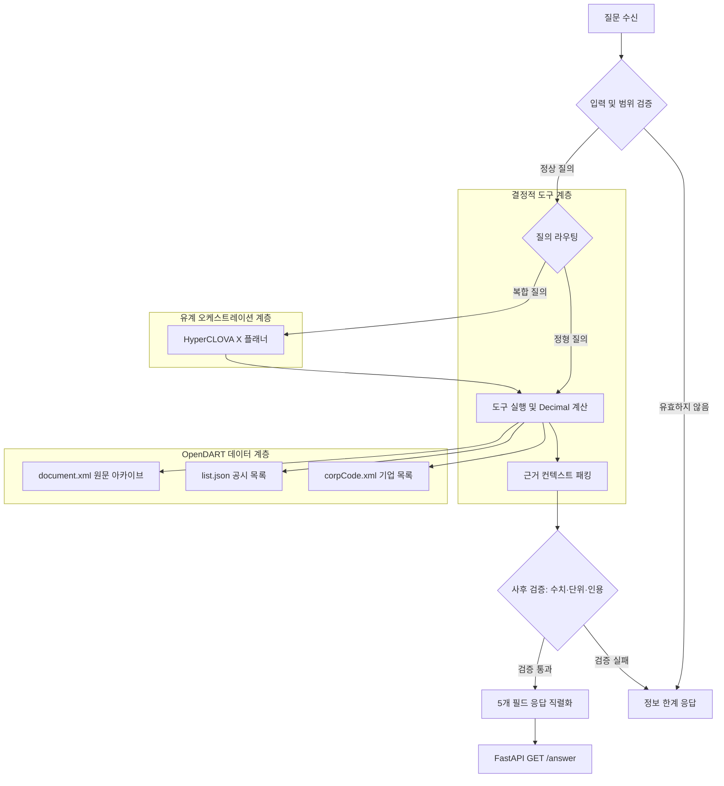

# 금융 공시 질의응답 에이전트 (Disclosure Agent)

한국어 기업 공시를 분석하여 재무 수치, 공시 이벤트, 정정 내역, 기업 개요 및 사업 내용을 정확하게 답변하는 금융 특화 RAG(Retrieval-Augmented Generation) 시스템입니다. 금융 분석가와 개발자가 신뢰할 수 있는 공시 질의응답을 제공하도록 설계되었습니다. 금융감독원 OpenDART 실시간 공개 API를 단일 데이터 원천(Live, Read-only)으로 활용하며, 사전 구축된 대용량 코퍼스나 SQLite/FTS 인덱스 파일 없이도 즉시 구동됩니다. 기업 고유번호 카탈로그(`corpCode.xml`), 공시 목록(`list.json`), 공시 원문 아카이브(`document.xml`)의 세 가지 엔드포인트를 사용하며, 기업 카탈로그는 첫 회사명 질의 시점에 지연 로딩(lazy-loading)되어 서버 기동을 지연시키지 않습니다.

## 시스템 아키텍처

질의 성격에 따라 처리 경로를 분기합니다. 단순 재무 지표 조회, 비율 연산, 업종 순위, 이벤트 합계 등 정형 질의는 모델 호출 없이 결정적 도구 계층에서 직접 처리하며, 복합 서술형 질의만 HyperCLOVA X(HCX-005) 플래너를 거쳐 유계(bounded) 도구 호출을 조율합니다. 모든 수치 연산에는 모델의 암산 대신 Python `Decimal` 모듈을 사용합니다. 질의당 도구 호출 최대 8회, 모델 호출 최대 6회, 내부 270초 하드 데드라인(Hard Deadline)의 엄격한 실행 예산 안에서 동작합니다.



## 질의 처리 흐름

1. **입력 및 범위 검증**: 질문 길이, 제어문자 유무, 공시 데이터베이스 범위를 검증합니다.
2. **질의 분석 및 라우팅**: 단일 지표나 정형 질의는 결정적 도구 경로로 직행하고, 복합 질의는 HyperCLOVA X 플래너로 전달합니다.
3. **기업 식별 및 공시 목록 탐색**: `corpCode.xml`로 기업 고유번호를 확인하고, `list.json`을 통해 해당 연도 및 보고서 접수번호를 확보합니다.
4. **공시 원문 수집 및 구조화 파싱**: `document.xml`에서 압축 원문을 수집한 뒤, 표 구조와 섹션 목차 계층을 보존하여 파싱합니다.
5. **결정적 수치 계산 및 컨텍스트 패킹**: 재무비율이나 증감률은 Python `Decimal` 모듈로 정밀 연산하고, 12개 정규 필드를 갖춘 표준 인용 컨텍스트를 구성합니다.
6. **사후 검증 및 안전 폐쇄(Fail-Closed)**: 답변에 포함된 핵심 수치, 단위, 인용 접수번호가 수집된 근거와 정확히 일치하는지 대조하며, 근거가 불충분하면 추측 대신 정보 한계 응답을 반환합니다.
7. **표준 응답 반환**: 검증을 통과한 답변을 5개 필수 필드로 직렬화하여 `GET /answer`로 전달합니다.

## 기능 지원 범위 및 한계

| 영역 | 정확한 지원 범위 | 현재 정보 한계(Information-Limit) 응답 대상 |
|---|---|---|
| **재무 수치 및 지표** | 사업보고서, 분·반기보고서에 명시된 재무제표 수치, Python `Decimal` 기반 비율 및 증감률 연산 | 원문에 공시되지 않은 외부 지표, 임의 추정치, 비정형 서식 미제공 항목 |
| **공시 메타데이터** | 기업 고유번호, 종목코드, 보고서 유형, 접수번호, 제출일자, 원문 목차 및 주요 본문 내용 | OpenDART 메타데이터에 포함되지 않은 한국표준산업분류(KSIC) 기준 순위 및 소속 판별 |
| **정정 공시 이력** | 공시명에 정정 표기된 최신 공시 식별, 최신 접수번호 기준 사실 전달 | `list.json` 메타데이터만으로 최초 원본 접수번호를 완전히 추적하기 어려운 복합 정정 계보 |
| **공시 이벤트** | 공시 목록상 명시된 주요 보고서 접수 현황 및 원문 내 명시된 사건 사실 | 구조화된 이벤트 금액·발생일자(정형 메타데이터 부재) 및 철회·취소 공시의 세부 계보 추적 |

## 핵심 설계 원칙

- **결정적 도구 우선 (Deterministic-First)**: 재무비율, 증감률, 기간 차감 연산은 모델 암산에 의존하지 않고 Python `Decimal` 기반 계산기로 수행하여 확률적 수치 오차와 반올림 환각을 차단합니다. 회사 식별, 공시 목록 조회, 원문 섹션 탐색 등 사실 조회는 닫힌 도구 집합으로 처리합니다.
- **정정 공시 계보 인식 (Correction-Lineage Awareness)**: 원본 공시와 정정 공시를 식별하여 항상 최신 공시 접수번호를 기준으로 사실을 검증합니다. 정정 계보가 불완전하거나 이전 원본 번호가 모호한 경우 단정적인 추측을 배제하고 정보 한계로 안전하게 분기합니다.
- **유계 플래너 및 사후 검증 (Bounded Planner & Post-Verification)**: 정형 질의는 모델 호출 없이 직행하고 복합 질의만 HyperCLOVA X 플래너로 라우팅합니다. 질의당 도구 호출 최대 8회, 모델 호출 최대 6회, 내부 270초 하드 데드라인의 엄격한 실행 예산을 둡니다. 생성된 답변의 수치, 단위, 인용 접수번호가 근거와 일치하는지 사후 검증하여 불일치 시 답변 생성을 중단합니다.

### 데이터 소스 안정성 및 처리 방식

- **원문 표(Table) 및 섹션 계층 보존**: DART 공시 원문 파싱 시 HTML 표를 마크다운 표로 변환하고 목차 계층 경로를 보존합니다. 재무제표와 주요 현황의 행·열 레이블과 수치가 왜곡 없이 정렬된 상태로 패킹됩니다.
- **질의당 유계 문서 수집 및 캐시 보호**: 단일 질의 처리 과정에서 신규 공시 문서 다운로드를 최대 5건으로 제한하고 동일 접수번호의 중복 다운로드를 차단합니다. OpenDART API 쿼터 고갈과 레이턴시 급증을 방지합니다.
- **장애 유형화 및 데이터 부재 분리**: OpenDART의 인증 오류, 쿼터 소진, 서비스 장애, 전송 오류, 비정상 응답 등 유형화된 장애는 단순 데이터 부재로 취급하지 않고 명확한 에러로 분기합니다. 일시적 백엔드 장애는 캐시에 남기지 않으며, 정상 조회가 완료된 실제 데이터 부재 결과만 안전하게 캐싱합니다.

## 빠른 시작 (Quick Start)

### 1. 환경 변수 설정

```sh
cp .env.example .env
```

`.env` 파일에 필요한 인증키를 설정합니다.

```ini
OPEN_DART=<OpenDART API 인증키>
HCX_API_KEY=<HyperCLOVA X API 인증키>
```

인증 키는 OpenDART 연동 시 `OPEN_DART`, NCloud/HCX 호출 시 `HCX_API_KEY`만 사용합니다. `HCX_API_KEY_SUBMIT`은 시스템에서 전혀 읽거나 사용하지 않습니다.

### 2. 로컬 서버 실행

```sh
PYTHONPATH=src .venv/bin/python -m uvicorn \
  disclosure_agent.server.main:app --host 127.0.0.1 --port 8001

curl -s http://127.0.0.1:8001/healthz
```

정상 상태에서는 `pipeline_release`와 `retrieval_release`가 모두 `opendart-runtime`으로 응답합니다.

### 3. Docker Compose 실행

```sh
docker compose build --pull
docker compose up -d

curl -s http://127.0.0.1:8080/healthz
```

### 4. 질의응답 API 호출 및 응답 규약

```sh
curl -G http://127.0.0.1:8080/answer \
  --data-urlencode "question_id=SAMPLE-001" \
  --data-urlencode "question=삼성전자 2024년 사업보고서상 매출액은 얼마인가요?"
```

성공 응답은 정확히 아래 5개의 문자열 필드로 구성된 JSON 객체를 반환합니다.

```json
{
  "question_id": "SAMPLE-001",
  "question": "삼성전자 2024년 사업보고서상 매출액은 얼마인가요?",
  "retrieved_context": "...",
  "think_trace": "...",
  "answer": "..."
}
```

- **상태 코드 규약**:
  - `200 OK`: 정상 응답 (5개 필드 계약 준수)
  - `422 Unprocessable Entity`: 잘못된 요청 형식 또는 파라미터 유효성 검증 실패 (`AgentInputError`)
  - `503 Service Unavailable`: 270초 내부 데드라인 초과 또는 일시적인 외부 연동 장애 (`temporary_unavailable`)

## 저장소 구조

```text
src/disclosure_agent/
├── agent/          # 질의 라우팅, 프롬프트, 5개 필드 답변 계약 및 사후 검증기
├── context/        # 12개 정규 필드 기반 근거 컨텍스트 패킹
├── corrections/    # 정정 공시 계보 및 최신 공시 추적
├── hcx/            # HyperCLOVA X 클라이언트 계약 및 런타임
├── parsing/        # 원문 XML/HTML 구조화 파싱 (마크다운 표 및 목차 계층 보존)
├── retrieval/      # 유계 어휘 검색 인터페이스
├── runtime/        # 실행 예산(8회 도구, 6회 모델, 270초 데드라인) 및 재시도 게이트웨이
├── server/         # FastAPI 기반 /healthz 및 /answer 서빙
├── sources/        # OpenDART API 연동 계층 (corpCode, list, document)
└── tools/          # 기업 식별, 공시 조회, Python Decimal 계산 도구

pipeline/           # 데이터 파이프라인 구성 요소
scripts/            # 평가, 감사, 계약 검증 유틸리티
tests/              # 단위, 계약, 통합 테스트 스위트
docs/               # 아키텍처 및 연동 문서
```

### 상세 문서 링크

- [OpenDART 개선 로드맵 (OPENDART_IMPROVEMENT_ROADMAP.md)](docs/OPENDART_IMPROVEMENT_ROADMAP.md)
- [API 상세 명세서 (API_SPEC.md)](docs/API_SPEC.md)
- [기술 제안서 및 아키텍처 설계 (TECHNICAL_PROPOSAL.md)](docs/TECHNICAL_PROPOSAL.md)
- [공개 소스 재현 안내 (SUBMISSION_REPRODUCE.md)](docs/SUBMISSION_REPRODUCE.md)

## 저장소 비포함 항목 안내

이 저장소는 순수 애플리케이션 소스 코드와 API 계약 검증 체계만 포함하며 다음 항목은 포함하지 않습니다.

- 금융감독원 제공 원본 공시 XML, HTML, PDF 원시 코퍼스
- 사전 빌드된 SQLite 데이터베이스 및 FTS5 검색 인덱스 파일
- 비공개 평가 데이터셋 및 내부 검수 케이스
- API 키 및 사용자 인증 자격 증명
