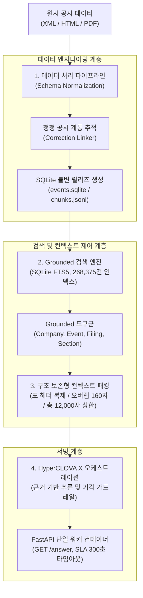

# HyperCLOVA X 기반 금융 공시 질의응답 시스템 (HCX05_MIRAE_ASSET)

> **대규모 한국어 금융 공시 코퍼스 대상 RAG 파이프라인 설계 및 API 서빙 기술서**

## 개요 (System Overview)
본 프로젝트는 70개 주요 상장사의 4,204건 금융 공시 문서(XML, HTML, PDF)를 기반으로 사용자 질의에 대해 신속하고 정확한 답변을 생성하는 종단간(End-to-End) RAG(Retrieval-Augmented Generation) 시스템입니다. 
지속적으로 갱신되는 정정 공시를 반영하는 스키마 정규화 파이프라인을 구축하고, 268,375건의 단위 청크에 대한 SQLite FTS5 기반 어휘 검색 인덱스와 표(Markdown Table) 구조를 보존하는 컨텍스트 패킹 메커니즘을 구현하였습니다. 검색된 근거에 기반하여 HyperCLOVA X를 오케스트레이션함으로써 금융 도메인의 환각(Hallucination)을 억제하였으며, 단일 워커 기반 FastAPI 컨테이너로 실시간 API 서빙을 지원합니다.

---

## 1. 배경 및 해결 과제 (Problem Statement & Goals)

금융 공시 문서는 기업의 재무 건전성 및 주요 경영 이벤트를 다루는 핵심 데이터이나, 자동화된 질의응답 파이프라인 구축 시 다음과 같은 엔지니어링 과제가 발생합니다:

1. **정정 공시 추적 (Information Volatility):** 동일 사안에 대해 다수의 정정 신고서(Correction)가 발생하므로, 구버전 공시를 참조할 경우 팩트 오류가 발생함.
2. **복합 문서 레이아웃 보존:** 다단 표 구조가 혼재되어 단순 고정 길이 청킹 시 표 헤더가 유실되어 행·열 수치 해석이 왜곡됨.
3. **엄격한 환각 방지 (Faithful Grounding):** 근거가 없거나 불명확한 질의에 대해 허위 정보를 생성하지 않고 보수적 기각(Abstention)을 수행해야 함.

---

## 2. 시스템 아키텍처 (System Architecture)

시스템은 **데이터 처리**, **검색 엔진**, **컨텍스트 패킹**, **모델 오케스트레이션 및 API 서빙**의 4개 핵심 모듈로 구성됩니다.



---

## 3. 데이터 파이프라인 및 정규화 (Data Engineering)

### 3.1 코퍼스 구성 및 무결성 관리
원시 데이터는 상장 기업 70개사의 4,204건 공시 문서로 구성됩니다. 빌드 재현성과 무결성을 보장하기 위해 SHA-256 기반의 불변(Immutable) 릴리즈 관리 체계를 적용하였습니다.

| 파이프라인 항목 | 처리 규모 | 설명 |
| :--- | :--- | :--- |
| 분석 대상 기업군 (Universe) | 70개사 | 유가증권 및 코스닥 주요 상장사 |
| 총 수집 공시 문서 (Documents) | 4,204건 | 정기 공시(사업·분반기보고서) 및 주요사항보고서 |
| 주요 경영 이벤트 (Events) | 3,150건 | 증자, 감자, 합병, 소송 등 정량 이벤트 메타데이터 |
| 정정 공시 링크 (Correction Links) | 1,004건 | 최신성(Latest) 보장을 위한 원본-정정 추적 쌍 |
| 검색 인덱스 레코드 (Chunk Rows) | 268,375건 | FTS5 검색 매핑용 단위 청크 |

### 3.2 정정 공시 추적 (Correction Linker)
공시의 유효성을 판별하기 위해 1,004건의 정정 공시를 분석하여 3가지 상태로 라우팅합니다:
- **Linked (정상 연결, 702건):** 원본 접수번호(rcept_no)와 1:1 매핑되어 최신 공시 내용으로 치환.
- **Ambiguous (복수 후보, 47건):** 복수 대상 공시 지정 건으로 별도 검증 큐로 분기.
- **Unresolved (미해결, 255건):** 원본 식별자 결측 등으로 인한 보수적 비배제 처리.

---

## 4. 검색 엔진 및 컨텍스트 패킹 (Retrieval & Context Packing)

### 4.1 어휘 검색 인덱스 (Retrieval Index)
단일 컨테이너 메모리 제약 하에서 빠른 응답성과 결정론적 검색 결과를 보장하기 위해 SQLite FTS5 `unicode61` 엔진을 사용합니다.
- **인덱스 사양:** 483,885,056 bytes (268,375개 레코드 매핑)
- **Grounded 도구군 (Toolset):**
  - `CompanyTool`: 질의 내 기업명 및 종목코드 정규화
  - `EventTool`: 공시 분류 및 이벤트 메타데이터 조회
  - `FilingTool`: 정정 링크를 반영한 최신 공시 원문 섹션 탐색
  - `CalculateTool`: 재무 수치 연산의 정확도를 위한 Decimal 기반 연산기

### 4.2 구조 보존형 컨텍스트 패킹 (Context Packing)
검색된 결과를 LLM 프롬프트에 주입할 때 발생하는 정보 왜곡을 방지하기 위해 다음 규칙을 적용합니다:

| 제약 파라미터 | 설정값 | 엔지니어링 설계 목적 |
| :--- | :--- | :--- |
| 패시지 최대 길이 (Passage Bound) | 2,400자 | LLM 주의 집중도(Attention) 유지 및 토큰 비용 최적화 |
| 전체 컨텍스트 상한 (Context Bound) | 12,000자 | HyperCLOVA X 입력 토큰 윈도우 한도 내 안전 마진 확보 |
| 패시지 간 오버랩 (Overlap) | 160자 | 문맥 단절 방지 및 문장 경계 보존 |
| 최대 패시지 수 (Max Passages) | 8개 | 관련도 낮은 노이즈 청크 유입 차단 |
| 소스 문서당 허용 패시지 | 최대 3개 | 단일 공시 편향 방지 및 다양한 근거 확보 |
| 마크다운 표 보존 정책 | Header Repeat | 표 분할 시 상단 헤더 및 구분자 행을 자동 복제 주입 |

---

## 5. 성능 검증 및 지표 분석 (Evaluation & Metrics)

### 5.1 검색 벤치마크 (Recall@10)
72개의 검증 질의 세트(Development 48건, Regression 12건, Holdout 12건) 중 승인된 청크 기반 케이스(29건)를 대상으로 검색 단계의 Baseline 성능을 측정하였습니다.

- **평가 세트 구성:**
  - 전체 생성 질의: 72건
    - Holdout (미개방 평가셋): 12건
    - Development & Regression: 60건
      - 기각(Rejected): 8건
      - 승인(Approved): 52건 (청크 기반 검색 대상 29건, 비답변/이벤트 전용 23건)

| 평가 지표 | 측정 결과 | 세부 내용 |
| :--- | :--- | :--- |
| **Recall@10 (Chunk Evidence)** | **51.72% (15 / 29)** | 상위 10개 반환 청크 내 정답 앵커 포함 비율 |
| 정합 실패 (Failure Breakdown) | 14건 | - 접수번호/섹션 불일치(Miss): 12건<br>- 식별자 불일치(Mismatch): 2건 |
| 검색 지연 시간 (Broad Search p50) | 4,324.65 ms | 어휘 검색 단독 실행 기준 중앙값 |
| 검색 지연 시간 (Broad Search p95) | 12,772.14 ms | 대량 청크 매핑 시 95분위 지연값 |

### 5.2 실패 원인 분석
- **어휘적 변이:** 한국어 어절 분제로 인한 약어, 영문 명칭, 띄어쓰기 차이로 FTS5 완전 일치 실패 발생.
- **지표명 표현 차이:** '영업이익', '영업손익', '매출총이익' 등 유사 회계 계정명에 대한 어휘 수준 매핑 한계.
- **장문 표 분산:** 다수 분기에 걸친 표 데이터가 단일 청크 범위를 초과하는 경우 랭킹 하락.

---

## 6. 서비스 서빙 사양 (Serving Specification)

공식 평가 규격을 준수하는 단일 워커 FastAPI 서버 환경을 제공합니다.

### 6.1 API 엔드포인트 규격
- **Method:** `GET /answer`
- **요청 파라미터:**
  - `question_id` (string): 질의 고유 식별자
  - `question` (string): 자연어 입력 질의
- **응답 형식:** `application/json` (5개 필수 문자열 필드 반환)
- **SLA 제약:** 타임아웃 300초, 최대 2회 재시도 처리 지원

### 6.2 로컬 구동 및 테스트

```bash
# 1. Docker Compose 기반 컨테이너 빌드 및 구동
docker compose build --pull
docker compose up -d

# 2. 상태 점검 엔드포인트 (모델 호출 없음, 인덱스 로드 확인)
curl http://127.0.0.1:8080/healthz

# 3. 모델 추론 질의 실행 (HyperCLOVA X API 호출)
curl -G http://127.0.0.1:8080/answer \
     --data-urlencode "question_id=LOCAL-001" \
     --data-urlencode "question=삼성전자 최근 공시를 알려줘"
```

---

## 7. 결론 및 향후 과제 (Conclusion & Future Work)

본 시스템은 금융 공시 데이터의 특수성(정정 공시, 복잡한 표 구조, 엄격한 팩트 일치)을 반영한 RAG 파이프라인을 구축하여 Baseline Recall@10 51.72% 및 안정적인 API 서빙 게이트를 달성했습니다.

**향후 개선 방향:**
1. **하이브리드 검색(Hybrid Retrieval):** FTS5 어휘 검색과 금융 특화 밀집 벡터(Dense Embedding) 검색을 결합하여 어휘 불일치 문제 해소.
2. **질의 의도 분석 및 재작성(Query Rewriting):** 다년도 비교 및 동의어 회계 계정명을 구조화된 조건으로 변환하는 사전 라우팅 에이전트 고도화.

