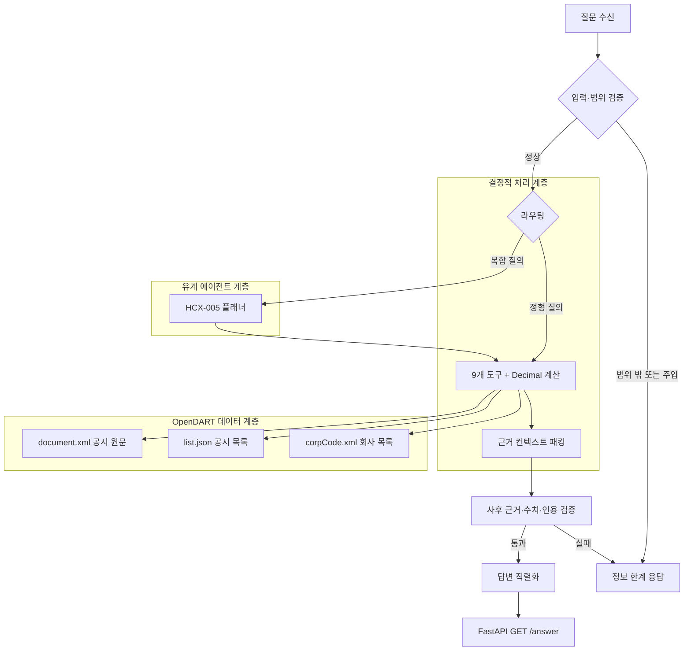

# 금융 공시 질의응답 에이전트 (Disclosure Agent)

한국어 기업 공시를 근거로 재무 수치, 공시 이벤트, 정정 이력, 기업 개요와 사업 내용을
조회·계산·요약하는 금융 특화 RAG(Retrieval-Augmented Generation) 시스템입니다.
HyperCLOVA X(HCX-005)는 복합 질의의 오케스트레이션을 담당하고, 수치 조회·계산·근거
검증은 결정적 도구와 Python `Decimal` 기반 로직으로 처리합니다.

이 브랜치(`codex/opendart-data-source`)는 금융감독원 **OpenDART API**를 기본 데이터
소스로 사용합니다. 기존 대회 코퍼스나 SQLite/FTS 산출물이 없어도 서버가 시작되며,
공시 목록과 원문은 요청 시 OpenDART에서 조회합니다. 회사명 조회에 필요한 전체 법인
목록은 첫 회사명 질의 때 지연 로딩하므로 서버 시작을 막지 않습니다.

## OpenDART 빠른 시작

Python 3.13 환경에서 의존성을 설치한 다음 `.env.example`을 복사해 두 키를 설정합니다.

```sh
cp .env.example .env
# OPEN_DART=<OpenDART API 인증키>
# HCX_API_KEY=<HyperCLOVA X API 인증키>
```

NCloud/HCX 요청은 `HCX_API_KEY`만 사용합니다. `HCX_API_KEY_SUBMIT`은 읽거나 대체 키로
사용하지 않습니다. `.env`는 Git에서 제외됩니다.

```sh
PYTHONPATH=src .venv/bin/python -m uvicorn \
  disclosure_agent.server.main:app --host 127.0.0.1 --port 8001

curl -s http://127.0.0.1:8001/healthz
```

정상 상태에서는 `pipeline_release`와 `retrieval_release`가 모두
`opendart-runtime`으로 표시됩니다. 현재 구현은 공시 목록·원문·회사 식별을 API로
제공하며, OpenDART 메타데이터에 없는 업종 분류, 구조화된 이벤트 금액/발생일,
검증된 정정 계보는 `info_limit`로 응답합니다. 실행 계약과 검증 결과는
[OpenDART 운영 안내](docs/codex/OPENDART_DATA_SOURCE_IMPLEMENTATION.md)에 정리했습니다.

실환경 스모크에서는 서버 시작과 `/healthz` 200 응답, 공시 목록 1건 조회, 해당
접수번호의 원문 ZIP 다운로드, 섹션 파싱 및 본문 읽기까지 확인했습니다. 이 과정에서
HCX 모델 호출은 실행하지 않았습니다.

```sh
PYTHONPATH=src .venv/bin/pytest -q \
  tests/unit/test_opendart_source.py tests/unit/test_opendart_production.py
```

이 저장소는 공개 가능한 애플리케이션 소스와 서빙 계약을 제공합니다. 주최 측 제공 원본
코퍼스, 생성된 SQLite/FTS 인덱스, 운영 산출물, 평가 케이스와 자격 증명은 저장소에
포함하지 않습니다.

<table>
<tr>
<td align="center"><b>OpenDART</b><br><sub>실시간 공시 데이터</sub></td>
<td align="center"><b>9</b><br><sub>결정적 도구</sub></td>
<td align="center"><b>270 s</b><br><sub>내부 hard deadline</sub></td>
<td align="center"><b>1</b><br><sub>FastAPI worker</sub></td>
</tr>
</table>

## 핵심 설계 원칙

### 결정적 도구 우선

회사 식별, 업종 후보 확정, 공시 이벤트 조회, 공시 목록·목차 탐색, 원문 섹션 조회,
어휘 검색, 정정 이력 조회, 사칙연산은 닫힌 도구 집합으로 처리합니다.

재무비율·증감률·기간 차감과 같은 계산은 모델이 암산하지 않고 Python `Decimal` 기반
계산기로 수행합니다. 따라서 모델의 생성 확률에 따라 수치·단위·반올림이 달라지지 않습니다.

### 정정 공시 계보 보존

원본 공시와 정정 공시를 `root_rcept_no` 및 `latest_rcept_no` 기준으로 연결합니다. 답변은
최신 여부와 관련 접수번호를 근거에 포함하며, 모호하거나 미해결된 연결은 확정된 최신
사실로 취급하지 않습니다.

### 유계 플래너와 사후 검증

단일 재무지표, 비율 계산, 업종 순위, 이벤트 합계와 같은 정형 질의는 모델 호출 없이
결정적 경로로 처리합니다. 복합·자유 질의만 HyperCLOVA X 플래너로 전달하며, 도구 호출
8회, 모델 호출 6회, 내부 hard deadline 270초의 실행 한도를 둡니다.

생성된 초안은 답변의 핵심 수치와 인용 접수번호가 실제 근거와 일치하는지 다시 검증합니다.
근거가 부족하거나 요청 범위를 벗어나면 추측 대신 정보 한계 응답으로 종료합니다.

## 시스템 구성



데이터 계층은 OpenDART API에 읽기 전용으로 접근합니다. 회사 목록은 회사명 식별이
필요한 첫 요청에서만 내려받고, 공시 목록과 원문은 질의 범위에 맞춰 요청 시 조회합니다.
별도의 코퍼스나 SQLite/FTS 릴리즈를 복원할 필요가 없습니다.

## 주요 처리 흐름

1. 질문의 길이·제어문자·공시 범위를 검증합니다.
2. 기업명, 영문명, 종목코드, 과거 사명을 DART 기업 식별자로 정규화합니다.
3. 정형 질의는 결정적 도구로 직접 처리하고, 복합 질의는 유계 HCX 플래너로 라우팅합니다.
4. OpenDART 공시 목록에서 기준연도와 보고서 유형을 확인합니다.
5. 내려받은 원문 섹션과 검색 청크를 컨텍스트로 패킹하고, 필요한 수치는 `Decimal`로 계산합니다.
6. 답변의 수치·단위·인용 접수번호를 검증한 뒤 API 응답으로 직렬화합니다.

## API 계약

평가 및 운영 서버는 인증 없는 순차 `GET` 요청을 수신합니다.

```http
GET /answer?question_id={id}&question={URL-encoded question}
```

성공 응답은 정확히 다음 다섯 개의 문자열 필드를 반환합니다.

```json
{
  "question_id": "EVAL-001",
  "question": "삼성전자 2024년 연결 매출액을 알려 주세요.",
  "retrieved_context": "...",
  "think_trace": "...",
  "answer": "..."
}
```

`/healthz`는 모델을 호출하지 않고 서비스 준비 상태와 데이터 릴리즈 식별자를 확인합니다.
잘못된 요청은 `422`, 내부 deadline 초과나 일시적 장애는 `503`으로 처리합니다.

### 로컬 실행 예시

```sh
cp .env.example .env
# .env에 OPEN_DART와 HCX_API_KEY를 로컬에서 설정

uv sync --locked --extra dev
uv lock --check
uv run python -c "import dotenv, requests; print('declared-runtime-imports: OK')"
uv run pytest --collect-only -q
uv run pytest -q

docker compose build --pull
docker compose up -d
curl --fail http://127.0.0.1:8080/healthz

curl -G http://127.0.0.1:8080/answer \
  --data-urlencode "question_id=LOCAL-001" \
  --data-urlencode "question=삼성전자 2024년 연결 매출액을 알려 주세요."
```

공개 소스 체크아웃만으로 코드·계약 테스트와 컨테이너 구성 검증을 수행할 수 있습니다.
실제 `/healthz` 및 `/answer` 실행에는 `OPEN_DART`와 `HCX_API_KEY`를 설정한 로컬
`.env`가 필요하며, 별도의 데이터 릴리즈는 필요하지 않습니다.

## 검증 기준

| 항목 | 기준 |
|---|---|
| Python | 3.13.11, `uv.lock` 고정 |
| 모델 | HyperCLOVA X HCX-005 native v3 |
| 검색 | OpenDART 원문 기반 유계 어휘 검색 |
| 서빙 | FastAPI + Uvicorn, worker 1개 |
| 컨테이너 | non-root 실행, read-only root filesystem, `/tmp` tmpfs |
| 계산 | Python `Decimal` 기반 결정적 연산 |
| 평가 계약 | 순차 호출, 내부 hard deadline 270초, 성공 시 5개 문자열 필드 |
| 데이터 릴리즈 식별자 | `opendart-runtime` |

기본 테스트는 OpenDART와 모델 API를 호출하지 않는 오프라인 테스트입니다. 실환경
스모크 테스트는 OpenDART 공시 목록·원문 조회와 `/healthz`까지 별도로 확인하며,
HCX 모델은 호출하지 않습니다.

## 저장소 구조

```text
src/disclosure_agent/
├── agent/          # 플래너, 프롬프트, 답변 계약 및 검증기
├── context/        # 컨텍스트 패킹
├── corrections/    # 정정 공시 계보 추적
├── hcx/            # HyperCLOVA X 클라이언트와 계약
├── retrieval/      # 검색 인터페이스와 결과 계약
├── runtime/        # 예산·재시도·서비스 런타임
├── server/         # FastAPI 애플리케이션
├── sources/        # OpenDART API 데이터 소스
└── tools/          # 회사·이벤트·공시·계산 도구

pipeline/            # 데이터 처리 및 릴리즈 빌드 로직
scripts/             # 감사·검색·평가·계약 검증 스크립트
tests/               # 단위·계약·통합·E2E 테스트
docs/API_SPEC.md     # HTTP API 명세
docs/TECHNICAL_PROPOSAL.md  # 상세 설계 및 실험 문서
```

## 공개 범위 및 보안

이 저장소에는 다음 항목을 포함하지 않습니다.

- 원본 DART XML·HTML·PDF 및 제공 코퍼스
- SQLite·FTS5 운영 인덱스와 생성된 대용량 산출물
- 개발·holdout 평가 케이스와 내부 검수 기록
- 에이전트 인계 문서, 작업 프롬프트, 개인 환경 설정
- `HCX_API_KEY` 및 기타 인증 정보

`.env`, 데이터 디렉터리, 아티팩트와 런타임 산출물은 `.gitignore`로 관리합니다.

## 문서

- [API 명세](docs/API_SPEC.md)
- [기술제안서 및 상세 설계](docs/TECHNICAL_PROPOSAL.md)
- [공개 소스 체크아웃 재현 안내](docs/SUBMISSION_REPRODUCE.md)
