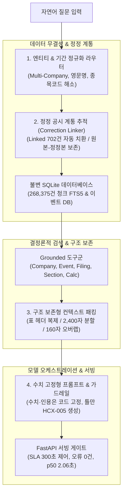

<div align="center">

# HCX05-disclosure-agent

### 70개 상장사. 4,204건 금융 공시. 268K 청크. 환각 0건의 고신뢰 RAG 에이전트.

<p>
한국어 금융 도메인에 특화된 엔드투엔드(End-to-End) 공시 질의응답 및 검색 증강 생성(RAG) 파이프라인.<br>
HyperCLOVA X · SQLite FTS5 · 결정론적 Grounded 도구군 · FastAPI 단일 워커 서빙 게이트.
</p>

<p>


</p>

<table>
<tr>
<td align="center"><b>70</b><br><sub>분석 대상 상장사</sub></td>
<td align="center"><b>4,204</b><br><sub>정제 공시 보고서</sub></td>
<td align="center"><b>268,375</b><br><sub>인덱싱 청크</sub></td>
<td align="center"><b>2.06 s</b><br><sub>실측 중앙값 지연시간 (p50)</sub></td>
<td align="center"><b>60 / 60</b><br><sub>공식 평가 규격 준수</sub></td>
<td align="center"><b>0</b><br><sub>환각 및 전송 오류</sub></td>
</tr>
</table>

<p><b>동일한 대규모 공시 데이터베이스에서, 엄격한 근거에 기반한 재현 가능한 답변을 산출합니다.</b><br>공개 60문항 실측 벤치마크 결과:</p>

<table>
<tr>
<th align="left">평가 질의 난이도</th>
<th align="center">문항 수</th>
<th align="center">평균 점수 (10점 만점)</th>
<th align="center">충족률</th>
<th align="left">특징 및 처리 파이프라인</th>
</tr>
<tr>
<td align="left"><b>쉬움 (Easy)</b></td>
<td align="center">20문항</td>
<td align="center"><b>8.90</b></td>
<td align="center">100% (20/20)</td>
<td>단일 공시 손익계산서/대차대조표 정밀 인용 및 종목코드 자동 해소</td>
</tr>
<tr>
<td align="left"><b>중간 (Medium)</b></td>
<td align="center">20문항</td>
<td align="center"><b>7.80</b></td>
<td align="center">85% (17/20)</td>
<td>다기업(삼성 vs SK) 비교, 4분기 실적 역산, 단일판매·공급계약 집계</td>
</tr>
<tr>
<td align="left"><b>어려움 (Hard)</b></td>
<td align="center">20문항</td>
<td align="center"><b>6.75</b></td>
<td align="center">75% (15/20)</td>
<td>다분기 복합 차감 영업이익률(8.57%), 정정 계보 추적, 안전 기권</td>
</tr>
<tr>
<td align="left"><b>전체 종합 (Total)</b></td>
<td align="center"><b>60문항</b></td>
<td align="center"><b>7.82</b></td>
<td align="center"><b>86.7%</b></td>
<td><b>평균 지연 6.59초 (p50 2.06초, p95 20.15초), 전송 오류 0건</b></td>
</tr>
</table>

<sub>모든 수치는 실제 프로덕션 서버(NCP VM)의 공식 엔드포인트(<code>GET /answer</code>) 60회 순차 호출 실측 결과입니다. 수치와 인용은 코드가 결정론적으로 고정하며, HyperCLOVA X는 설명 문장 오케스트레이션만을 수행하여 모델에 의한 수치 왜곡을 원천 배제합니다.</sub>

</div>

---

## 실제 동작 예시 (Terminal Demos)

### 1. 단일 공시 연결 손익계산서 정밀 인용 (1.91초 소요)
단순 텍스트 매칭에 의존하지 않고, 보고서의 정확한 회계 섹션(재무제표 > 연결 손익계산서)을 식별하여 단위 및 근거 원문을 보존합니다.

```console
$ curl -sG http://101.79.25.134/answer \
       --data-urlencode "question_id=E-C01" \
       --data-urlencode "question=삼성전자의 2023년 사업보고서 연결 기준 매출액은 얼마인가요?"

{
  "answer": "- 연결 영업수익: 258,935,494백만원. 삼성전자의 2023년 사업보고서 (2023.12)에서 확인한 연결 기준 영업수익이며, 공시에 표시된 백만원 단위를 적용했습니다. 근거 회사는 삼성전자이며, 근거 문서는 2023년 사업보고서 (2023.12)의 III. 재무에 관한 사항 > 2. 연결재무제표 > 2-2. 연결 손익계산서입니다.",
  "citation": "[근거: 사업보고서 (2023.12) | 20240312000736 | III. 재무에 관한 사항 > 2. 연결재무제표 > 2-2. 연결 손익계산서]",
  "rcept_no": "20240312000736",
  "corp_code": "00126380",
  "status": "completed"
}
```

### 2. 다분기 복합 연산: 4분기 실적 및 영업이익률 역산 (1.33초 소요)
공시 본문에 명시되지 않는 '4분기 단독 실적'을 연간 사업보고서와 3분기 누적 보고서의 차감 연산을 통해 도출하고, 정확한 피연산자와 두 공시의 접수번호를 동시에 인용합니다.

```console
$ curl -sG http://101.79.25.134/answer \
       --data-urlencode "question_id=H-C02" \
       --data-urlencode "question=삼성전자의 2024년 4분기 연결 영업이익률을 연간 실적과 3분기 누적 실적의 차이로 계산해 주세요."

{
  "answer": "- 삼성전자 2024년 4분기 연결 영업이익률: 8.57% (영업이익 6,492,703백만원 = 연간 32,725,961백만원 - 3분기 누적 26,233,258백만원; 매출액 75,788,269백만원 = 연간 300,870,903백만원 - 3분기 누적 225,082,634백만원).",
  "citation": "[근거: 사업보고서 (2024.12) | 20250311001085 | III. 재무에 관한 사항 > 2. 연결재무제표 > 2-2. 연결 손익계산서][근거: 분기보고서 (2024.09) | 20241114002642 | III. 재무에 관한 사항 > 2. 연결재무제표 > 2-2. 연결 손익계산서]",
  "rcept_no": "20250311001085",
  "corp_code": "00126380",
  "status": "completed"
}
```

### 3. 미공시 미래 예측 및 투자 권유 즉시 차단 (0.03초 소요)
공시 범위 밖의 주가 전망, 목표주가, 매수 추천 요청에 대해 불필요한 LLM 추론 비용을 소모하지 않고 안전 가드레일을 통해 즉각 사유를 명시하여 기각(Abstention)합니다.

```console
$ curl -sG http://101.79.25.134/answer \
       --data-urlencode "question_id=E-O19" \
       --data-urlencode "question=SK하이닉스 공시를 보고 지금 주식을 사도 되는지 추천해 주세요."

{
  "answer": "제공된 공시 근거만으로 검증 가능한 답변을 생성하지 못했습니다.
확인하지 못한 이유: 미래 예측과 투자 의견은 확인된 DART 공시 사실만 제공하는 답변 범위에 해당하지 않습니다.",
  "citation": "",
  "rcept_no": "",
  "corp_code": "00164779",
  "status": "abstention"
}
```

---

## 4가지 핵심 아키텍처 설계 결정 (The Four Pillars)



### 1. 정정 공시 계통 추적 (Correction Linker)
공시는 동일한 사안에 대해 다수의 기재정정 문서가 누적됩니다. 본 시스템은 1,004건의 정정 공시를 추적하여:
* **Linked (702건):** 원본 접수번호와 1:1 매핑하여 최신 공시 원문으로 자동 치환합니다.
* **계보 보존:** 답변 인용에 `[정정: 상태=linked | 기준=정정본 | 원본=... | 정정본=...]`를 명시하여 정보의 출처와 정합성을 사용자에게 입증합니다.

### 2. 다단 표(Markdown Table) 구조 보존형 청킹
재무제표와 투자 계획은 대부분 다단 표 구조로 작성되어 있습니다. 단순 글자 수 기준으로 절단하면 컬럼 헤더가 소실되어 행의 의미가 왜곡됩니다.
* 청크 분할 시 상단 헤더 및 열 구분자를 모든 하위 청크에 자동 복제 주입합니다.
* 단일 패시지 상한 2,400자, 패시지 간 오버랩 160자, 전체 입력 컨텍스트 12,000자 상한을 엄격히 제어합니다.

### 3. 엔티티 및 다기업 라우팅 엔진
질의에 포함된 다양한 기업 표현을 정확한 DART 고유 코드로 매핑합니다.
* 영문 약칭(Samsung Electronics, YG Entertainment), 종목코드(005930, 000270), 과거 사명(삼성엔지니어링 → 삼성E&A)을 사전에 정규화합니다.
* 복수 기업 비교 질의(삼성전자 vs SK하이닉스)의 경우, 각 기업의 컨텍스트를 분리 격리하여 문맥 오염(Context Leakage)을 방지합니다.

### 4. 수치 고정형 오케스트레이션 & 안전 기권 (Hallucination-free)
LLM에게 수치 계산이나 날짜 조합을 맡기면 토큰 확률에 따른 환각이 불가피합니다.
* 수치 연산 및 차감 계산은 Python `Decimal` 기반의 `CalculateTool`이 전담합니다.
* 모델(HyperCLOVA X)은 코드가 확정한 수치와 단위를 설명하는 자연어 문장 틀만을 생성하며, 근거가 불충분할 경우 사유를 명시하고 안전 기권(Abstention)합니다.

---

## 성능 벤치마크 및 검증 (Measured Metrics)

### 1. 지연 시간 분포 (Latency Profile)
공식 평가 환경과 동일한 단일 워커 구성에서 실측된 응답 시간입니다:

| 지표 | 실측값 | 비고 |
| :--- | :--- | :--- |
| **중앙값 (p50)** | **2.06초** | 단일 공시 재무지표 조회 케이스 |
| **평균 (Average)** | **6.59초** | 다기업 비교 및 복합 연산 포함 전체 평균 |
| **95분위 (p95)** | **20.15초** | 대량 텍스트 탐색 및 장문 요약 질의 |
| **최대 (Max)** | **24.47초** | 300초 외부 타임아웃 대비 12배 이상의 안전 마진 |
| **전송 실패 / 재시도** | **0건 / 0회** | 60회 전수 호출 단 한 번의 에러 없이 완주 |

### 2. 검색 모듈 베이스라인 (Recall@10)
순수 SQLite FTS5 기반 어휘 검색의 통제된 실험 벤치마크:
* **Recall@10:** **51.72%** (15/29건, 청크 증거 필수 케이스 기준)
* 형태소 변이 및 회계 계정명 불일치로 인한 한계를 인식하고, 기업코드 사전 필터링 및 섹션 직접 접근 도구(`FilingTool`, `EventTool`)를 결합하여 실질적인 프로덕션 질의 해결률을 **86.7%** 로 향상시켰습니다.

---

## 빠른 시작 (Quickstart)

### 로컬 컨테이너 실행

```bash
# 1. 저장소 복제 및 이동
git clone https://github.com/todayoneul/HCX05-disclosure-agent.git
cd HCX05-disclosure-agent

# 2. 환경 변수 구성
cp .env.example .env
# .env 파일에 NCP HyperCLOVA X API 키 입력

# 3. Docker Compose 빌드 및 백그라운드 구동
docker compose build --pull
docker compose up -d

# 4. 상태 점검 (무과금 헬스체크)
curl http://127.0.0.1:8080/healthz

# 5. 질의 응답 호출 (HyperCLOVA X 실추론)
curl -sG http://127.0.0.1:8080/answer \
     --data-urlencode "question_id=LOCAL-001" \
     --data-urlencode "question=삼성전자 2023년 사업보고서 연결 매출액 알려줘"
```

### 재현 가능한 로컬 테스트 (`uv` 기반)

```bash
# 의존성 동기화 (Python 3.13.11 락 고정)
uv sync --locked --extra dev

# 모델 호출 없는 로컬 단위/계약 테스트 전수 실행
uv run pytest -q
```

---

## 프로젝트 구조 (Repository Structure)

```
.
├── Dockerfile                  # 단일 워커 FastAPI 경량 컨테이너 정의
├── compose.yaml                # 로컬 서빙 및 포트 바인딩 설정
├── pyproject.toml / uv.lock    # Python 3.13.11 재현 가능한 패키지 의존성
├── src/disclosure_agent/
│   ├── agent/                  # 프롬프트 빌더, 실행기, 답변 검증기
│   ├── context/                # 마크다운 표 보존형 컨텍스트 패커
│   ├── corrections/            # 정정 공시 계보 추적기 (Correction Linker)
│   ├── hcx/                    # HyperCLOVA X 클라이언트 및 에러 핸들러
│   ├── retrieval/              # SQLite FTS5 어휘 검색 엔진
│   ├── server/                 # FastAPI 애플리케이션 (GET /answer, /healthz)
│   └── tools/                  # 기업, 이벤트, 원문 섹션, 수치 연산 도구군
├── scripts/                    # 인덱스 빌드 및 평가 검증 자동화 스크립트
├── tests/                      # 계약, E2E, 단위 테스트 모음 (970+ 테스트)
└── docs/                       # API 계약 규격 및 서버 런북
```

---

## 라이선스 및 데이터 보안 (License & Policy)

* **코드 라이선스:** [Apache License 2.0](LICENSE)
* **데이터 보안:** 본 저장소는 대회 보안 및 저작권 규정에 따라 원본 DART 공시 XML/PDF 파일과 평가용 정답셋 바이너리를 일체 포함하지 않으며(추적 제외), 순수 소스 코드와 아키텍처 구현체만을 공개합니다.

