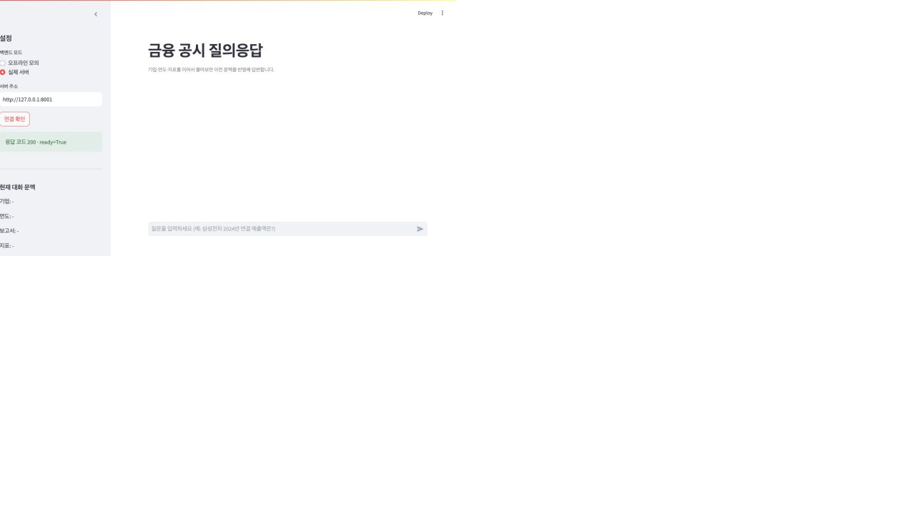
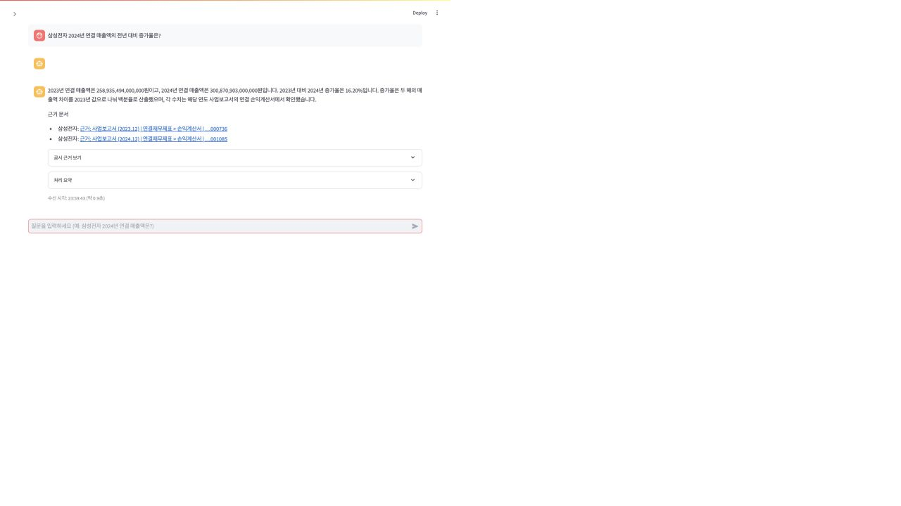
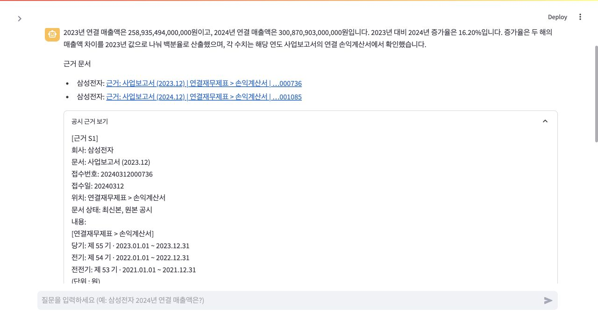
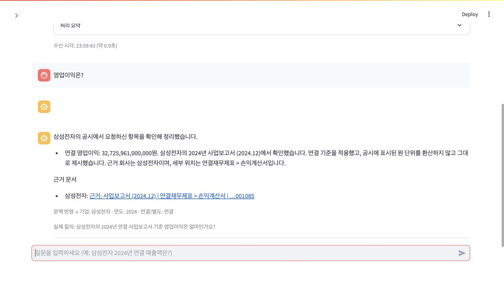

# 공시 에이전트 대화형 UI 사용 안내 (CHAT_UI_USAGE)

로컬 Mac 브라우저에서 공시 에이전트와 대화하듯 질문하고, 답변과 공시 근거를
확인하며 후속 질문을 이어갈 수 있는 Streamlit 채팅 UI입니다. 기존 FastAPI
`GET /answer` 계약을 그대로 사용하며, UI 프로세스는 에이전트 서버와 분리되어
있어 서버 주소만 바꾸면 다른 작업본에도 연결할 수 있습니다.

## 빠른 시작 (키 없이 바로 체험)

기본값은 오프라인 모의 모드라 API 키 없이도 전체 흐름을 시험할 수 있습니다.

```sh
uv sync --extra ui
PYTHONPATH=. .venv/bin/streamlit run ui/streamlit_app.py --server.port 8600
```

브라우저에서 http://127.0.0.1:8600 을 열고 다음처럼 물어보세요.

1. `삼성전자 2024년 연결 매출액은?`
2. `그럼 전년에는?` (기업·지표를 유지한 채 2023년으로 해석)
3. `영업이익은?` (기업·연도를 유지)
4. `두 해의 증가율도 계산해줘` (연도 대비 증가율 질문으로 변환)
5. `이번에는 SK하이닉스는?` (기업 변경 반영)

모의 모드는 삼성전자·SK하이닉스·현대자동차의 2023-2024 매출액·영업이익 샘플만
제공합니다. 표시되는 수치는 예시이며 실제 공시 값이 아닙니다.

## 실제 서버에 연결하기

1. 프로젝트 `.env`에 `OPEN_DART`, `HCX_API_KEY`를 설정합니다.
   NCloud/HCX 호출에는 `HCX_API_KEY`만 사용하며 `HCX_API_KEY_SUBMIT`은 쓰지 않습니다.
2. 에이전트 서버를 실행합니다.

```sh
PYTHONPATH=src .venv/bin/python -m uvicorn \
  disclosure_agent.server.main:app --host 127.0.0.1 --port 8001
```

3. 다른 터미널에서 UI를 실행합니다.

```sh
PYTHONPATH=. .venv/bin/streamlit run ui/streamlit_app.py --server.port 8600
```

4. 사이드바에서 백엔드 모드를 `실제 서버`로 바꾸고 서버 주소
   (예: `http://127.0.0.1:8001`)를 입력한 뒤 `연결 확인`을 누릅니다.

## 실제 사용 화면

아래 화면은 실제 OpenDART 백엔드에 연결해 삼성전자 2023·2024 사업보고서를 조회한 결과입니다.

### 서버 연결



### 검증된 답변과 공시 링크



### 원문 근거 확인



### 후속 질문 문맥 반영



## 화면 구성

- 중앙: 사용자·에이전트 말풍선, Markdown 답변, 질문 입력창.
- 답변 아래: `공시 근거 보기`(retrieved_context), `처리 요약`(think_trace),
  문맥 반영 내역, 실제 질의 문장, 수신 시각.
- 사이드바: 백엔드 모드, 서버 주소, 현재 대화 문맥(기업·연도·보고서·지표·연결/별도),
  새 대화, 대화 내보내기(Markdown).

## 동작 원칙

- 후속 질문은 결정적 규칙으로 기업·연도·기간·지표·연결/별도 문맥을 반영해
  독립적으로 이해 가능한 질문으로 바꾼 뒤 서버에 보냅니다. 모호하면 되묻습니다.
- 이전 답변의 숫자를 새 사실 근거로 재사용하지 않습니다. 모든 후속 수치 답변도
  서버의 조회·계산·검증 경로를 다시 통과합니다.
- 질문 길이 4,000자 제한과 5개 문자열 응답 계약을 지킵니다.
- 요청 처리 중에는 중복 전송을 막습니다. 서버는 답변을 직렬 처리합니다.
- 오류 표시: `422`는 형식/길이 안내, `503`은 일시적 실패·시간 초과, 연결 실패는
  서버 주소·실행 상태 확인 안내로 구분합니다.

## 테스트

```sh
PYTHONPATH=. .venv/bin/python -m pytest -q tests/ui
```

UI 계층 테스트는 외부 API 없이 문맥 정규화, 요청·오류 매핑, 모의 응답 계약을
검증합니다.

## 알려진 제한

- 대화 이력은 세션 내 임시 저장이며 새로고침 시 유지되지 않습니다. 필요하면
  `대화 내보내기`로 Markdown을 저장하세요.
- 브라우저 탭을 닫는 동작 자체는 별도의 취소 API를 호출하지 않습니다. 서버 내부
  타임아웃이 발생하면 취소 신호와 남은 시간 예산이 OpenDART·HCX 계층으로 전파됩니다.
- 조회 범위 밖 원본처럼 유일하게 연결할 수 없는 정정 계보와 OpenDART 메타데이터에
  없는 업종 분류는 서버의 정보 한계 응답을 그대로 표시합니다.
