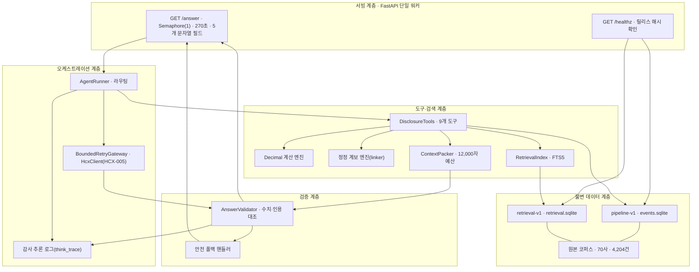
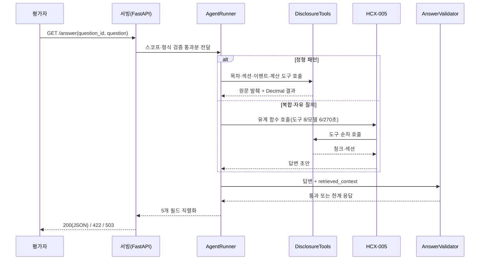

# 기술제안서: 신뢰성 기반 금융 공시 질의응답 에이전트 (Disclosure Agent)

## 1. 제안 요약

본 프로젝트는 DART 전자공시 문서를 근거로 재무 지표, 정정공시 계보, 공시 이벤트, 기업
프로필과 사업 개요 질의를 처리하는 금융 특화 AI 에이전트다. 설계의 목표는 두 가지다.
답변의 모든 사실을 제공된 공시 원문으로 되짚을 수 있게 하고, 근거가 없거나 모호한
요청에는 지어내지 않고 한계를 밝히는 것이다.

이를 위해 두 가지 아키텍처 원칙을 택했다. 첫째는 **결정적 도구 우선(Deterministic
Tools First)** 으로, 수치 조회와 계산을 언어 모델의 생성이 아니라 정해진 도구와 Python
`Decimal` 연산으로 처리한다. 둘째는 **사후 검증 기반 안전 차단(Post-Validation
Fail-Closed)** 으로, 모델이 만든 답변 초안도 근거와 대조해 통과하지 못하면 한계 응답으로
되돌린다.

대상 데이터는 주최 측이 제공한 고정 코퍼스(70개 기업, 4,204건 공시)로 한정한다. 원문
코퍼스를 SQLite 구조화 데이터베이스(`pipeline-v1`, `events.sqlite`)와 FTS5 유니코드
어휘 색인(`retrieval-v1`)으로 가공하고, 두 산출물 모두 SHA-256 체크섬으로 릴리스를
고정한다. 단일 재무 수치, 파생 비율, 업종 순위, 이벤트 합계, 기업 개요 같은 정형 질의는
모델 호출 없이 결정적 경로로 답하고, 복합·자유 질의는 HyperCLOVA X(HCX-005)를 도구 호출
8회, 모델 호출 6회, 하드 타임아웃 270초의 상한 안에서 사용한다.

현재 런타임은 커밋 `195808c9a777d6b4dd9749cb09eb46feabfad508`이며, 제공 코퍼스 기반
테스트를 포함해 2,034건의 테스트가 통과한다.

## 2. 문제 정의

기업 공시 질의응답은 일반 문서 QA와 다른 제약을 갖는다. 다섯 가지 난제가 설계를
결정했다.

**문서의 방대함과 비정형 구조.** 정기보고서는 분량이 크고 XML 본문에 표와 각주가 섞여
있다. 특히 재무제표와 투자·자금조달 표는 셀 병합, 단위 표기, 소계·합계 행이 뒤섞여
단순 청킹만으로는 문맥이 끊기거나 수치를 잘못 읽기 쉽다.

**빈번한 기재정정.** 하나의 사안이 원본 공시와 여러 정정본으로 나뉘어 접수된다. 원본과
정정본의 계보를 추적하지 않으면 이미 정정된 과거 수치를 최신 사실처럼 제시하게 된다.

**계산 오류와 환각.** 부채비율·유동비율·ROE·전년 대비 증감률은 정밀한 산식을 요구한다.
언어 모델의 암산은 자릿수·반올림에서 어긋날 수 있고, 근거가 부족할 때 없는 사실을
만들어낼 수 있다.

**엄격한 서빙 규격.** 평가 시스템은 단일 순차 `GET` 호출과, 성공 시 정확히 다섯 개의
문자열 필드(`question_id`, `question`, `retrieved_context`, `think_trace`,
`answer`)만 담은 JSON 응답을 요구한다. 이 계약은 어떤 경로로 답하든 동일하게 지켜져야
한다.

**정보 한계 준수.** 외부·미공개 정보 요구, 미래 예측, 투자 조언, 프롬프트 주입 시도에는
무리하게 답하지 않고 한계를 분명히 밝혀야 한다.

## 3. 아키텍처

시스템은 다섯 계층으로 나뉜다. 위에서 아래로 서빙, 오케스트레이션, 검증, 도구·검색,
불변 데이터 계층이다. 각 계층은 아래 계층에만 의존하며, 데이터 계층은 읽기 전용이다.

| 계층 | 책임 | 주요 구현 |
| --- | --- | --- |
| 서빙 | 요청 검증, 동시성 제한, 응답 직렬화, 준비 상태 확인 | FastAPI, `Semaphore(1)`, `/answer`, `/healthz` |
| 오케스트레이션 | 정형·복합 경로 선택, 제한된 모델·도구 호출, 감사 로그 생성 | `AgentRunner`, `BoundedRetryGateway`, `think_trace` |
| 검증 | 수치·접수번호·단위·정정 여부 대조, 실패 시 안전 차단 | `AnswerValidator`, 한계 응답 핸들러 |
| 도구·검색 | 회사·공시·섹션·이벤트 조회, 정밀 계산, 문맥 패킹 | 9개 `DisclosureTools`, `Decimal`, `ContextPacker`, FTS5 |
| 불변 데이터 | 원문과 구조화·검색 산출물의 동일성 보장 | `pipeline-v1`, `retrieval-v1`, SHA-256 릴리스 |

**불변 데이터 계층.** 원본 `data/3.공시/corpus`는 70개 기업, 4,204건 공시(XML 및
PDF+HTML)로 구성된다. 전처리는 이 원본을 두 산출물로 가공한다. `pipeline-v1`의
`events.sqlite`는 4,204건 문서 메타데이터, 3,150건 이벤트, 1,004건 정정 계보를 담은
구조화 데이터베이스이며 릴리스 해시는
`50d9a055f0811118b902d9937f2359c866acc07d886183e90bd2697547ef88bd`이다.
`retrieval-v1`은 268,375건 공시 청크의 FTS5 `unicode61` 어휘 색인이며 릴리스 해시는
`3f16e81a440c47b899b6c48a4bfb1a88277967da92f3f7cabd0806c63a9506d5`이다. 두 릴리스는
콘텐츠 주소화된 디렉터리에 저장되고, 포인터 파일이 SHA-256으로 릴리스를 고정한다.

**도구·검색 계층.** `DisclosureTools`는 9개 도구로 SQLite와 FTS5를 읽기 전용으로 조회한다.
회사 식별(`resolve_company`), 업종 후보 확정(`resolve_sector`), 이벤트 조회
(`query_events`), 공시 목록·목차 탐색(`list_filings`, `list_sections`), 섹션 원문
조회(`read_section`), 어휘 검색(`search_chunks`), 정정 이력 추적(`get_history`),
결정적 사칙연산(`calculate`)이다. 정정 계보 엔진(`corrections/linker.py`)은 접수번호
사이의 원본·정정 관계를 원본·연결·모호·미해결로 분류한다. `ContextPacker`는 검색된
청크를 중복 제거하고 출처별 최대 3개, 전체 12,000자, 패시지당 2,400자, 최대 8개 패시지
예산 안에서 마크다운 표 구조를 보존해 패킹한다.

**검증 계층.** `AnswerValidator`는 답변의 핵심 수치와 인용 접수번호가 근거 패시지와
정합하는지 확인하고, 단위 일치와 DART 링크 형식, 정정 고지 여부를 점검한다. 위반이나
범위 밖 질의는 안전 폴백 핸들러가 한계 응답으로 전환한다.

**오케스트레이션 계층.** `AgentRunner`는 질문에서 회사·연도·기준월·지표·공시 유형을
식별해 결정적 경로로 연결하거나, 복합 질의일 때 HCX-005 순차 플래너를 기동한다.
`BoundedRetryGateway`는 남은 시간 예산에 맞춰 타임아웃을 조정하고 일시 오류(429, 503)에
한 번 지수 백오프 재시도를 한다. 모든 도구 호출과 검증 단계는 `think_trace`로 요약된다.

**서빙 계층.** FastAPI 단일 워커 컨테이너가 `asyncio.Semaphore(1)`과 단일 스레드
실행기(`ThreadPoolExecutor(max_workers=1)`)로 평가자의 단일 순차 호출을 그대로 처리한다.
`GET /healthz`는 모델 호출 없이 준비 상태와 두 릴리스 해시를 반환한다.

## 4. 처리 흐름

질문 수신부터 응답 반환까지 일곱 단계를 거친다.

1. **질문 검증·스코프 필터링.** 제어문자와 길이(최대 4,000자)를 검사하고, 시스템 프롬프트
   유출·비밀키 요청·외부 뉴스·미래 예측 요구를 감지해 거부 사유를 만든다.
2. **분해·라우팅.** 회사명·연도·기준월·지표·공시 유형을 식별한다. 기업 정보, 사업 요약,
   단일 지표, 재무비율, 업종 순위, 이벤트 합계, 임원 보수 같은 정형 패턴이면 전용 경로로
   보낸다.
3. **근거 수집.** 전용 경로는 목차 조회 후 대상 섹션 원문을 직접 추출한다. 플래너 경로는
   HCX-005가 도구를 순차 호출해 청크와 섹션을 모은다.
4. **계산·패킹.** 수치 연산은 `calculate`로 Decimal 처리하고, 증거는 접수번호와 최신
   여부가 포함된 헤더로 `retrieved_context`에 패킹한다.
5. **답변 생성.** 전용 경로는 검증된 수치와 원문 완결 문장으로 답을 구성하고, 플래너
   경로는 패킹된 컨텍스트에 근거해 초안을 만든다.
6. **사후 검증.** 핵심 수치와 접수번호의 근거 정합성을 확인하고, 실패 시 한계 응답으로
   되돌린다.
7. **직렬화.** HTTP 200이면 다섯 개 문자열 필드로 반환하고, 잘못된 요청은 422, 데드라인
   초과나 일시 장애는 503으로 응답한다.

## 5. 핵심 설계 결정

**계산과 생성의 분리.** 재무비율, 4분기 역산(연간 실적 − 3분기 누적) 같은 산식은 전부
`calculate` 도구의 Decimal 연산으로 처리한다. 모델은 어떤 경우에도 최종 수치를 직접
암산하지 않는다. 파생 비율 질의에서는 분자·분모가 되는 원문 행을 먼저 근거로 확보한 뒤
계산하므로, 답변에 쓰인 수치를 공개 근거에서 그대로 되짚을 수 있다.

**정정 계보의 명시적 취급.** 근거 패시지 헤더에 최신 여부와 접수번호를 표시하고, 정정본을
인용할 때는 정정 사실을 함께 고지한다. 모호·미해결 계보는 확정 계보로 취급하지 않고
근거로 올리지 않는다.

**정형 경로 우선.** 자주 나오는 질의 유형은 모델을 거치지 않는다. 이는 지연과 비용을
줄이는 동시에, 답변 형식과 근거 표기를 결정적으로 만들어 재현성을 높인다.

**표 구조 보존 패킹.** 재무·투자 표는 마크다운 헤더와 구분선을 유지한 채 완결 행 단위로만
패킹한다. 셀 수가 맞지 않거나 헤더와 함께 들어가지 못하는 행은 쪼개지 않고 통째로
제외한다. 단위·기수(예: 제57기, 2025.01.01~2025.12.31)를 날짜와 매핑해 함께 싣는다.

**Fail-Closed 기본값.** 검증에 실패하거나 근거가 불충분하면 무리한 답 대신 한계 응답을
낸다. 복합 요청에서 일부만 확인되면 확인된 항목과 미확인 항목을 함께 표시한다.

## 6. 실험 과정

실험은 데이터 파이프라인 고정, 검색 색인 구축, 반복 진단, 반례 기반 하드닝, 배포 전후
검증의 순서로 수행했다. 각 단계의 입력과 판정 기준을 코드와 테스트로 남겨 같은 조건에서
다시 실행할 수 있게 했다.

| 단계 | 검증 대상 | 실험 방법 | 산출물·판정 기준 |
| --- | --- | --- | --- |
| 1. 데이터 고정 | 코퍼스 누락·중복, 정정 계보 | 입력 파일 해시, 문서군별 개수, 계보 상태 집계 | 70사·4,204건, `pipeline-v1` SHA-256 일치 |
| 2. 검색 구축 | 청크 누락·중복, 표 구조 보존 | 색인-원문 매핑 검사, 패킹 예산·행 완결성 검사 | 268,375행, `retrieval-v1` SHA-256 일치 |
| 3. 품질 진단 | Closed/Open 유형별 정확성·완전성 | 결정적 진단 묶음과 실제 HTTP 질의의 답변·근거 대조 | 필수 항목, 기준기간, 단위, 5개 필드 확인 |
| 4. 반례 하드닝 | 표 오독, 의미 혼동, 요청 누락 | 실패 재현 테스트 작성 후 최소 수정과 전체 회귀 | 결함별 전용 회귀 테스트 통과 |
| 5. 배포 검증 | 환경 차이, 계약 파손, 지연 | 격리 후보 컨테이너, 해시·헬스체크·공개 API 점검 | 후보 통과 후 교체, 이전 이미지 롤백 보존 |

### 6.1 데이터 파이프라인 구축과 고정

전처리는 원본 코퍼스를 두 산출물로 바꾼다. `scripts/build_pipeline.py`는 정기공시 XML을
파싱해 문서 메타데이터, 이벤트, 정정 계보를 하나의 SQLite(`events.sqlite`)로 만든다.
결과는 4,204건 문서, 3,150건 이벤트, 1,004건 정정 계보(연결 702건, 모호 47건, 미해결
255건)로 고정되며, 소스 순서를 보존해 재실행 시 동일한 릴리스를 낳는다.
`scripts/audit_corpus.py`는 70개 기업·4,204건 문서·문서군별 개수·XML과 PDF+HTML 분할을
잠그고 모든 입력 파일을 해시해 코퍼스 계약을 검증한다.

산출물은 콘텐츠 주소화 디렉터리에 저장하고, 같은 볼륨의 포인터 파일만 원자적으로 교체한다.
이 방식으로 빌드가 중간에 실패해도 이전 릴리스가 그대로 유지되고, 서빙은 항상 해시로
검증된 단일 스냅숏만 읽는다.

### 6.2 검색 색인과 컨텍스트 패킹

`scripts/build_retrieval.py`는 공시 청크를 FTS5 `unicode61` 색인으로 만든다. 결과는
268,375건의 매핑·색인 행이며, 중복·누락 매핑이 없고 파이프라인 릴리스에 계보로 묶인다.
`unicode61`은 의존성이 없고 결정적이지만, 한국어 어절 토큰화 특성상 임의의 부분 문자열이나
형태 변화를 완전히 회수하지는 못한다. 이 한계를 인지한 상태에서, 근거 완전성은 색인 회수
품질뿐 아니라 컨텍스트 패킹 단계가 함께 책임진다.

`ContextPacker`는 검색 결과를 출처별 최대 3개, 전체 12,000자, 패시지당 2,400자, 최대
8개 패시지 예산 안에서 패킹한다. 표는 헤더와 구분선을 반복해 완결 행 단위로만 싣고, 셀
수가 어긋난 행은 제외한다. 중복은 출처 ID와 본문 SHA-256으로 정확히 제거한다.

### 6.3 반복 진단 하네스

품질은 여러 개의 진단 스크립트로 관찰했다. `evaluate_open_profile_quality.py`는 회사
개요·사업 요약 계열을, `evaluate_open_closed_quality.py`와 `evaluate_rubric_quality.py`는
대회 참고 질의 유형(정보추출·다중조회·복합추론 × Closed/Open × 난이도)을 폭넓게 점검한다.
이 진단들은 모델 없이도 결정적 경로를 그대로 재현하며, 실제 서버에는 별도의 HTTP 회귀로
같은 질의를 보내 5개 필드 계약·기준기간·근거 완전성·지연을 확인했다.

진단은 정답 채점이 아니라 실패를 드러내기 위한 장치다. 새 질의 묶음을 돌려 답변을 직접
읽고, 근거에서 되짚어지지 않는 수치나 요청 누락, 표 오독을 찾아 다음 단계의 반례로 넘겼다.

### 6.4 반례 기반 하드닝 순환

각 결함은 "실패를 재현하는 테스트를 먼저 작성하고(RED), 최소 수정으로 통과시키고(GREEN),
전체 회귀로 부작용을 확인하는" 순환으로 고쳤다. 이 과정에서 다음과 같은 대표 결함이
드러나고 해결됐다.

- **파생 비율의 피연산자 누락.** 부채비율·유동비율·ROE 질의에서 답은 맞아도 부채총계·자본총계
  같은 피연산자가 컨텍스트 truncation으로 공개 근거에서 빠지는 경우가 있었다. 핵심 표 행을
  단위·기수와 함께 우선 패킹하도록 바꿔, 계산에 쓴 다섯 개 피연산자가 근거에도 실리게 했다.
- **투자계획과 집행 실적의 혼동.** 연간 시설투자 "계획"을 수시공시 투자결정 이벤트로 잘못
  라우팅하거나, 표 말단 숫자와 "다음과 같습니다" 같은 안내 문장을 계획으로 서빙하던 문제를
  분리했다. 집행 실적 표는 자체 헤더·인접 단위·정확한 연간 기간을 요구하고, 향후 계획과
  구분해 표시한다.
- **표 단위·기간의 표 내부 귀속.** 앞선 표의 "백만원"을 다음 표에 잘못 적용하거나 12월 30일
  종료를 연간 실적으로 받아들이던 경계 사례를 반례로 재현해, 단위와 기간을 각 표 내부로만
  귀속하도록 고쳤다.
- **동일 공시 내 복수 표의 임의 선택.** 한 본문에서 유효 투자 표가 둘 이상이면 첫 표를
  임의로 고르지 않고, 범위를 단정할 수 없으므로 모호성으로 판단해 기각하도록 바꿨다.
- **자금조달 유형 누락.** 유상증자·CB·BW·EB로 정리를 요청받으면 확인된 유형과 확인되지 않은
  유형을 각각 명시한다. 발행 결정만 확인되면 실제 납입·발행 완료로 단정하지 않는다.
- **사업 요약의 부문 누락과 슬로건 혼입.** 카카오 콘텐츠 4부문(게임·뮤직·스토리·미디어)
  총괄 문장이 배타 한정자가 없는데도 필터로 탈락하거나, 브랜드 슬로건 문장이 사업 개요로
  오인되던 문제를 고쳤다. 요구 영역과의 교집합만 요구하도록 완화하고, 슬로건·미션 문형을
  개요에서 배제했다.
- **다년도 핵심 제품 비교의 혼입.** "핵심 제품의 변화만" 요청에 시장 경기 전망이나 매출 실적
  문장이 섞이던 문제를 막고, 개요 섹션의 주력 제품 문장을 단일 권위 쌍으로 추출하도록 했다.
- **철도차량 자회사 오분류.** 자동차 사업 요약에서 철도차량 자회사 설명이 주력 자동차 사업을
  대체하던 회귀를 반례로 잡아 수정했다.

각 수정은 전용 반례 테스트로 남아 회귀를 막는다. 최종 빌드는 제공 코퍼스 기반 테스트를
포함해 2,034건이 통과하며, 실제 서버에 대한 HTTP 회귀에서도 5개 필드 계약과 근거
완전성을 확인했다.

### 6.5 배포와 검증 절차

배포는 검증된 소스만 서버로 옮겨 이미지를 교체하는 절차를 따른다. 커밋에서 런타임 파일만
추려 tar로 묶고 SHA-256을 대조한 뒤, 서버에서 네트워크 차단·읽기 전용·제한된 임시공간
환경으로 후보 컨테이너를 먼저 실행해 원본 코퍼스로 진단을 재현한다. 후보가 통과하면
기존 이미지를 롤백 태그로 보존한 채 공개 컨테이너를 교체하고, 교체 후 `/healthz`의 두
릴리스 해시와 `/answer`의 5개 필드 계약·지연을 확인한다. 문제가 있으면 보존한 이미지로
되돌린다.

## 7. 주요 활용 시나리오

**단일 재무지표 조회.** "삼성전자 사업보고서의 2024년 연결 매출액"을 물으면, 삼성전자를
식별하고 2024년 사업보고서 연결 손익계산서 섹션을 조회해 원문 수치(300,870,903백만원)를
단위 그대로 제시하며 DART 출처 링크를 붙인다.

**파생 재무비율 계산.** "2024년 연결 부채비율·유동비율·ROE"를 물으면, 같은 기준연도
재무제표에서 부채총계·자본총계·유동자산·유동부채·당기순이익을 찾아 `calculate`로 산출하고,
산식과 분자·분모 원문 수치를 함께 보여준다. 이때 다섯 피연산자는 공개 근거에도 실린다.

**업종 내 순위 비교.** 업종 후보를 확정한 뒤 각 사의 지표를 정렬하고, 공시 단위와 억원
환산값(소수 둘째 자리)을 병기한다.

**자금조달 유형별 정리.** "카카오가 2025년에 실시한 자금조달을 유상증자·CB·BW·EB로 정리"를
물으면 유형별 결정 공시를 조회해 확인된 CB 결정 내역과 나머지 유형의 미확인 상태를 함께
표시하고, 발행 결정만 확인된 경우 실제 납입·발행 완료는 단정하지 않는다.

**기업 프로필·사업 요약.** 설립일·본점·대표이사와 사업 부문을 회사의 개요·사업의 내용
섹션의 완결 문장으로 발췌한다. 연도를 지정하지 않으면 제공된 최신 연간 공시의 기준기간을
밝힌다.

**정보 한계 대응.** 제조업 매출과 금융업 영업수익처럼 손익 체계가 다른 비교, 외부 뉴스·미래
예측·프롬프트 주입 요청은 사유를 설명하는 한계 응답으로 답한다.

## 8. 기대 효과와 운영상 한계

**기대 효과.** 사칙연산과 파생비율을 Decimal 엔진으로 분리해 수치 안정성을 확보한다. 모든
답변에 접수번호와 DART 링크를 매핑해 사후 확인을 쉽게 한다. 정형 질의는 모델 없이 처리해
지연과 비용을 줄이고, `think_trace`로 도구 호출과 검증 과정을 함께 제공한다.

**운영상 한계.** 답변은 제공 코퍼스 범위 안에서만 유효하다. 직원 수의 복합 합계표, 모든
사업위험 유형의 포괄 정리, 다년도 사업 변화의 원인·결과 분석은 지원 범위가 제한적이며,
확인되지 않는 항목은 한계로 답한다. 두 시점의 같은 주제 발췌를 제시하더라도 전체 사업에
변화가 없다고 단정하지 않는다.

## 9. 향후 확장성

**하이브리드 검색.** 현재 검색은 FTS5 `unicode61` 어절 어휘 색인이다. 한국어 형태소
분석기와 도메인 임베딩을 결합한 밀집·희소 하이브리드 검색을 더하면 부분 문자열·형태 변화에
대한 회수율을 높일 수 있다.

**도메인 특화 튜닝.** 지금은 사전 학습된 HCX-005에 프롬프트와 함수 호출 정책만 적용한다.
공시 특화 데이터로 질의 분해·도구 선택을 튜닝하면 복합 질의의 정확도를 개선할 수 있다.

**공시 유형·연동 확대.** 제공 코퍼스에 한정된 현재 범위를 넘어 증권신고서·감사보고서 등으로
문서 유형을 넓히고, 실시간 공시 연동 파이프라인을 붙이는 것은 서비스 단계의 과제다.

**동시성 확장.** 단일 워커·단일 세마포어 구조를 분산 큐와 다중 워커로 확장하면 동시 요청
처리량을 늘릴 수 있다.

## 부록: 운영 제원

- **런타임 소스 커밋**: `195808c9a777d6b4dd9749cb09eb46feabfad508`
- **테스트**: 제공 코퍼스 기반 테스트 포함 2,034건 통과
- **고정 데이터 릴리스**
  - pipeline-v1: `50d9a055f0811118b902d9937f2359c866acc07d886183e90bd2697547ef88bd` (`events.sqlite`)
  - retrieval-v1: `3f16e81a440c47b899b6c48a4bfb1a88277967da92f3f7cabd0806c63a9506d5` (`retrieval.sqlite`)
- **배포 엔드포인트**: `http://101.79.25.134/answer` (NCP 단일 컨테이너)
- **런타임 상한**: 도구 호출 8회, 모델 호출 6회, 하드 타임아웃 270초
- **컨텍스트 예산**: 전체 12,000자, 패시지당 2,400자, 출처별 3개, 최대 8개 패시지
