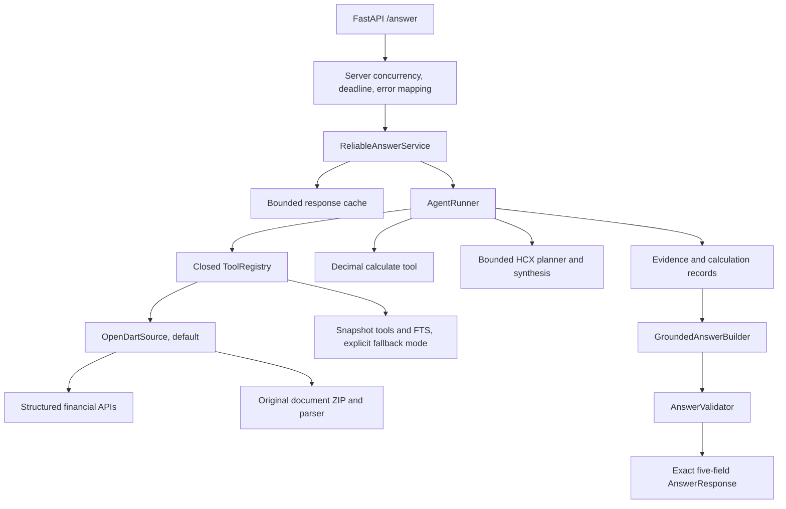

# HCX05 Disclosure Agent Current Architecture Review

- Review date: 2026-09-18 (Asia/Seoul)
- Base commit: `5df0f8c9f07b6a707c629ee5fa0927473e9557b9`
- Review branch: `chore/phase0-production-safety`
- Scope: repository-wide Phase 0 investigation and selection of one safe P0 change
- Evidence labels: **CONFIRMED**, **LIKELY**, **NEEDS MEASUREMENT**

This review describes the repository at the base commit above. It does not treat the mission prompt as the source of truth. Findings marked **CONFIRMED** are directly supported by code, tests, commands, or Git history. **LIKELY** findings are code-supported risks whose production impact has not been measured. **NEEDS MEASUREMENT** items cannot be resolved from static inspection or the existing test suite.

## 1. Executive Summary

The system is already more disciplined than a generic RAG application. It has an exact five-field HTTP response, bounded model and tool execution, `Decimal` arithmetic, immutable evidence and calculation records, correction-aware filing selection, strict answer validation, and a live OpenDART source that prefers structured financial endpoints before downloading original documents. The public `think_trace` is an audit narrative rather than hidden model reasoning.

The largest maintainability risk is concentrated orchestration. `src/disclosure_agent/agent/runner.py` has 13,488 lines, 209 functions, and a 5,287-line `AgentRunner.run`. It combines routing, Korean-language semantic rules, financial workflow logic, tool planning, evidence selection, calculations, model calls, fallback behavior, and auditing. `sources/opendart.py`, `agent/validator.py`, and `tool_registry.py` are smaller but similarly combine multiple boundaries.

The most immediate production-safety findings are:

1. **CONFIRMED — dependency lock is stale.** Both `uv sync --locked --extra dev` and `uv lock --check` fail at the base commit, while the Docker build also uses `uv sync --locked`. A fresh checkout is therefore not reproducible through the documented path.
2. **CONFIRMED — queue wait is outside the request deadline.** `server.app.answer` creates the deadline only after acquiring `answer_semaphore`, so a queued request can remain connected longer than the nominal 270 seconds.
3. **CONFIRMED — the default container cannot refresh its persistent OpenDART catalog cache.** Production places the cache under `/app/artifacts`, while Compose mounts that path read-only and makes the root filesystem read-only. `_write_catalog_cache` suppresses `OSError`, so this becomes silent in-memory-only behavior.
4. **CONFIRMED — unknown financial basis is collapsed to separate basis.** `section_financial_basis` returns `"separate"` for every financial section path that does not contain `"연결"`; absence of a marker is not proof of a separate statement.
5. **CONFIRMED — CI, linting, type checking, and structured operational metrics are absent.** The repository has strong offline tests but no `.github/workflows`, Ruff, mypy, or production metrics pipeline.

The smallest safe P0 improvement is to restore lockfile consistency. It directly repairs fresh-install and container-build reproducibility, changes no production behavior, and can be proven by turning the two pre-existing failing commands green. Queue deadlines, cache persistence, and financial-basis semantics should follow as separate behavior-changing PRs with focused regression tests.

### Baseline

Baseline commands were run before any repository modification. `uv run --frozen` was used after the two locked-install checks failed so that test collection and execution could not rewrite the lockfile.

| Item | Result |
|---|---|
| Git commit | `5df0f8c9f07b6a707c629ee5fa0927473e9557b9` |
| Python | `3.13.11` |
| uv | `0.9.26` |
| Key dependencies | FastAPI `0.141.1`; Uvicorn `0.52.4`; Pydantic `2.13.5`; httpx `0.28.1`; requests `2.34.2`; pytest `9.1.1` |
| Static analysis | Ruff not installed; mypy not installed |
| `uv sync --locked --extra dev` | **PRE-EXISTING FAILURE** — lockfile needs update |
| `uv lock --check` | **PRE-EXISTING FAILURE** — lockfile needs update |
| Collection | 2,078 tests in 0.50 s |
| Full suite | 2,073 passed, 5 skipped, 0 failed in 4.40 s; confirmation run in 4.72 s |
| Unit | 1,838 passed in 2.76 s |
| Integration | 152 passed, 5 skipped in 1.63 s |
| Contract | 58 passed in 0.38 s |
| E2E | 5 passed in 0.48 s |
| UI | 20 passed in 0.05 s |

The five skips are explicit opt-ins: one requires restored corpus assets and four require `--pipeline-root` for immutable real-corpus gates. They are not test failures.

## 2. Current Architecture



### Main boundaries

| Boundary | Current implementation | Assessment |
|---|---|---|
| HTTP | `server/app.py:create_app` | Thin on domain logic; owns input validation, sequential execution, timeout mapping, serialization, and basic logs. |
| Composition | `server/production.py:build_production_service` | Builds credentials, source, tool registry, HCX transport, runtime identity, runner, validator/builder, and cache wiring in one function. |
| Application runtime | `runtime/service.py:ReliableAnswerService` | Validates identity, caches only completed answers, checks deadline/cancellation, and maps temporary failures. |
| Orchestration | `agent/runner.py:AgentRunner.run` | Main hotspot; domain and orchestration are heavily mixed. |
| Tool boundary | `tool_registry.py:ToolRegistry` | Closed set of nine tools with schemas, bounded output, lineage checks, dispatch, and evidence adaptation. |
| Data source | `sources/opendart.py:OpenDartClient/OpenDartSource` | Default live source; strict errors, bounded downloads, structured-first financial retrieval, document fallback, parsing, search, and correction metadata. |
| Deterministic domain helpers | `agent/financial_basis.py`, `agent/periods.py`, `tools/calculate.py`, `corrections/linker.py` | Valuable pure logic, but financial semantics are not represented by one typed fact contract. |
| Evidence and response | `agent/contracts.py`, `agent/validator.py` | Immutable evidence/calculation/audit objects and strict final validation. |
| Optional legacy source | `retrieval/fts.py`, `tools/` | Immutable snapshot plus SQLite/FTS path selected only with `DATA_SOURCE=snapshot`. |
| UI | `ui/` | Separate Streamlit client of the public API; backend does not import UI modules. |

### Dependency map

Static AST analysis found no exact strongly connected component among package modules. `agent.runner` has the highest internal fan-out at 15 modules; `server.production` and `agent.validator` each fan out to nine.

There are two near-cycles/coupling seams:

- `retrieval/fts.py` imports `tools.common`, while `tools/__init__.py:DisclosureTools.__init__` lazily imports `retrieval.fts`. The lazy import avoids a runtime cycle but indicates that retrieval and tool infrastructure are not cleanly directed.
- `agent.contracts` and `runtime.contracts` use identity types from `tool_registry`, while the registry adapts agent evidence contracts. This is not an import cycle today, but domain contracts depend on an infrastructure-oriented registry module.

### Largest production modules

| Module | LOC | Functions | Classes | Main concern |
|---|---:|---:|---:|---|
| `agent/runner.py` | 13,488 | 209 | 1 | Routing, workflows, finance rules, evidence, model calls, and synthesis in one module |
| `sources/opendart.py` | 2,136 | 71 | 13 | HTTP client, error taxonomy, catalog, filings, finance, documents, parsing, correction, search, and caches |
| `agent/validator.py` | 1,597 | 39 | 5 | Claim validation, citation parsing, semantic validation, presentation, repair, and safe fallback |
| `tool_registry.py` | 927 | 28 | 6 | Tool schemas, semantic input checks, dispatch, normalization, evidence adaptation, lineage, and output bounds |
| `server/production.py` | 298 | 7 | 3 | Credentials, paths, source selection, transport, runtime identity, and full composition root |

Although `server/production.py` is not the fifth-largest file, it is in the top five for responsibility concentration because it owns nearly every production dependency decision.

## 3. Request Execution Flow

1. `server.app.answer` accepts exactly `question_id` and `question`; duplicate, missing, or extra query parameters return sanitized `422 invalid_request`.
2. `validate_question` applies bounded string validation.
3. A request hash and start time are created. The raw question is not logged.
4. The request waits on `asyncio.Semaphore(1)` and then receives a deadline. **CONFIRMED:** queue wait precedes deadline creation.
5. Work is submitted to a one-thread `ThreadPoolExecutor`; `answer_with_context` binds deadline and cancellation state through context variables.
6. `ReliableAnswerService` checks the exact-response cache, invokes `AgentRunner`, checks lineage and request identity, calls `GroundedAnswerBuilder`, rechecks deadline/cancellation, and caches only a completed valid response.
7. `AgentRunner` selects deterministic or model-assisted routes, calls only registered tools, accumulates evidence/calculation/audit records, and produces `AgentRunResult`.
8. `GroundedAnswerBuilder` validates the answer, optionally repairs model-authored output using only existing evidence, revalidates, and otherwise fails closed.
9. Success returns exactly `question_id`, `question`, `retrieved_context`, `think_trace`, and `answer`.

Error mapping is deliberately narrow at the HTTP boundary: bad input becomes 422; timeouts, temporary dependencies, and internal contract failures become sanitized 503; grounded absence or unsupported scope remains a 200 `information_limit` response. The broad final `except Exception` in `server.app` is appropriate as a trust boundary. The broad catches inside `ReliableAnswerService.answer` erase the original internal failure category and cause, which limits diagnosis.

## 4. Financial Data Flow

```mermaid
flowchart LR
    Q[Question] --> RESOLVE[Resolve company from OpenDART catalog]
    RESOLVE --> FILINGS[List bounded filing candidates]
    FILINGS --> LINEAGE[Apply correction and withdrawal semantics]
    LINEAGE --> FIN{Structured financial query?}
    FIN -->|yes| API[fnlttSinglAcnt / fnlttMultiAcnt]
    FIN -->|no or inadequate| ZIP[Original-document ZIP]
    API --> FACTLIKE[Bounded rows rendered with basis and period cues]
    ZIP --> PARSER[Section and table parser]
    PARSER --> SEARCH[Section-aware bounded search]
    FACTLIKE --> REGISTRY[Tool result and evidence]
    SEARCH --> REGISTRY
    REGISTRY --> WORKFLOW[Runner workflow]
    WORKFLOW --> DECIMAL[Deterministic Decimal calculation]
    DECIMAL --> PROVENANCE[Evidence, operands, calculation record]
    PROVENANCE --> VALIDATE[Claim/citation/period/basis validation]
```



Structured APIs preserve `CFS`/`OFS`, statement family, current/prior period values, and quarterly current-period versus cumulative fields. Original documents are bounded to 32 MiB, parsed with section hierarchy, and tables are expanded across `rowspan`/`colspan` into deterministic Markdown. Search downloads at most five new candidate documents, and the document LRU retains at most eight.

The weak point is the handoff from source rows to calculations. The repository has `EvidenceItem`, `CalculationRecord`, `AgentRunResult`, and citation contracts, but it does not have a common typed `FinancialFact` carrying value, currency, unit scale, period scope, statement basis, correction status, and evidence. Those semantics are repeatedly extracted from strings and checked inside individual runner workflows. This makes correctness dependent on every workflow remembering every compatibility check.

## 5. LLM Boundary

HCX is bounded to two intended roles: planner/tool selection for queries not covered by deterministic routes, and explanation/synthesis or repair of evidence-backed output. Financial arithmetic remains in `tools/calculate.py` using `Decimal`. The model is not the authoritative source of numbers, filing identity, correction lineage, or citations.

`agent/prompts.py` already separates `PLANNER_SYSTEM_PROMPT`, `FINAL_SYSTEM_PROMPT`, and final user-prompt construction. Repair prompting lives with the answer builder and prohibits new facts, numbers, or citations. `server.production._prompt_config_version` hashes agent/response configuration, planner prompt, routing policy, trace policy, and final prompt into runtime identity. The model identifier is also part of the cache identity.

Production disables the optional HCX presentation pass for deterministic answers (`enable_deterministic_presentation=False`). Model-authored output is still validated, and repaired output is validated again. This is a strong existing boundary.

**NEEDS MEASUREMENT:** the repository does not report what percentage of representative OpenDART questions invoke HCX, how many calls each route uses, or whether model use improves quality for each category. The existing evaluation objects can record model/tool counts, but there is no current live-OpenDART benchmark populated with those measurements.

## 6. Retrieval Architecture

There are two retrieval modes:

- Default `opendart`: structured financial APIs first; otherwise bounded original-document retrieval, section-aware parsing, lexical scoring, and document-local caches.
- Explicit `snapshot`: immutable pipeline snapshots, SQLite tools, and FTS5 retrieval.

The OpenDART path is therefore not accurately described as a single generic lexical RAG system. For common financial metrics it can avoid original-document retrieval. When documents are required, `parsing.periodic` preserves section paths, table captions, unit hints, row/column alignment, and expanded spans; `ContextPacker` preserves table headers while enforcing 2,400 characters per passage, 12,000 total characters, eight passages, and three passages per source.

Search results are deterministic for identical source responses and code, but a live source can change and HCX synthesis can vary. The source watermark only reflects filings observed by the current process, not a global OpenDART release. There is no measured OpenDART retrieval Recall@k/MRR baseline, so causes of real retrieval misses and the value of reranking remain **NEEDS MEASUREMENT**.

## 7. Correction-Lineage Architecture

The repository has two conservative correction mechanisms:

- `corrections/linker.py` links parsed event corrections only with trusted periodic keys, target-date/content evidence, or returns `ambiguous_candidate` / `unresolved_external_root`. It validates predecessor compatibility and rejects cycles.
- `OpenDartSource._apply_correction_lineage` uses OpenDART `rm` flags plus a normalized report-chain key, excludes withdrawals from latest-effective selection, and exposes unresolved external roots rather than fabricating a predecessor.

Tests cover equal report titles that must not create a chain, linked corrections, withdrawals, ambiguous ties, unresolved roots, and cycle protection. This directly contradicts any assumption that the current system simply selects the latest filing date or links by title alone.

One limitation remains: lineage in `OpenDartSource` depends on the filing rows observed in the process and bounded query windows. A correction whose predecessor is outside the observed window remains unresolved, which is the safe outcome. A dedicated file-backed offline fixture suite for multiple corrections and partial windows is still absent.

## 8. Runtime / Deadline / Retry Flow

`RuntimeConfig` bounds the hard deadline to 270 seconds, retry window to 30 seconds, retries to at most one, retry delay to five seconds, response cache to 1,024 entries, and cache TTL to one day. Production defaults are one retry, 128 entries, and 300 seconds.

`BoundedRetryGateway` is the sole HCX retry owner. It does not retry read timeouts, retries only eligible rate-limit/server/transport failures, and refuses a retry that cannot fit the remaining deadline. `_HcxTransportGateway` derives connect/read timeout from the remaining budget and reuses a session.

The server propagates a cancel event and deadline to the worker. OpenDART and runner code consult the shared execution context before starting additional work. A Python thread already executing cannot be forcibly terminated by `future.cancel()`, so it may continue until a cooperative checkpoint or network timeout; the one-thread executor prevents overlapping answer work while that happens.

**CONFIRMED deadline defect:** `server.app.answer` sets `started` before the semaphore but sets `deadline` inside it. Queue time is visible in logs but does not consume the hard deadline. The current E2E suite validates sequential execution, execution timeout, restart, no overlap, and cooperative cancellation, but not an arrival-to-response deadline.

**CONFIRMED overload gap:** there is no bounded waiter count or immediate overload rejection. Concurrent requests can accumulate as coroutine waiters and open client connections behind the semaphore. The production impact requires load measurement, but the missing bound is visible in code.

## 9. Cache Architecture

| Cache | Key / identity | Bound / TTL | Persistence and invalidation | Finding |
|---|---|---|---|---|
| Company catalog | Cache schema, rows digest, fetch time | 64 MiB; seven-day default, configurable 60 s–30 d | JSON file; age and SHA-256 validated | Good validation, but default container path is not writable and write failure is silent. |
| Filing metadata | Receipt number in `OpenDartSource._filings` | No explicit process-wide entry bound or TTL | Process memory; updated from observed calls | **LIKELY** long-lived growth under broad traffic; needs load data. |
| Parsed documents | Receipt number | LRU, eight documents; source payload max 32 MiB | Process memory; evicted by count | Bounded count, but byte footprint and hit rate are unmeasured. |
| Search/structured financial result | None beyond retained documents/filings | Per-call page and document fan-out bounds | Recomputed | Repeated structured API calls are possible; quota impact unmeasured. |
| Final response | `question_id`, normalized question hash, pipeline/retrieval release, prompt config, model contract | LRU 128; 300 s | Process memory; invalidated by process-observed source watermark | Exact request identity is safe, but identical questions with different IDs cannot reuse work. |
| Snapshot retrieval | Immutable release identities | Artifact-defined | Read-only artifacts and digests | Reproducible when assets are restored. |

The final response cache's inclusion of `question_id` is **CONFIRMED** and its docstring calls it an exact-request cache. This protects the public response identity. There is no documented decision about foregoing semantic reuse, and no separate internal semantic-result object that can be rebound to a new ID. Changing this safely requires evidence/provenance identity tests and is not a first P0 fix.

The response cache is not synchronized. That is safe under the current single-worker answer path. A future configurable-concurrency change must add synchronization or isolate caches before increasing concurrency.

## 10. Deployment Architecture

The Docker image pins Python `3.13.11` and uv `0.9.26`, installs locked production dependencies, copies only `src`, runs as UID 10001, exposes one Uvicorn worker, and includes a `/healthz` health check. Compose binds only loopback port 8080, mounts artifacts and data read-only, sets the root filesystem read-only, gives `/tmp` a bounded no-exec tmpfs, drops all capabilities, and enables `no-new-privileges`.

The security posture is sound, but the catalog path is inconsistent with it:

- `ProductionPaths.from_root('/app')` gives `/app/artifacts/pipeline-v1`.
- `build_production_service` selects `/app/artifacts/opendart-company-catalog-v1.json`.
- Compose mounts `/app/artifacts:ro` and sets `read_only: true`.
- `OpenDartSource._write_catalog_cache` catches `OSError` and returns without logging.

Thus a pre-existing valid host cache can be read, but an absent, stale, or invalid cache cannot be persisted after network warmup. The checked-out ignored `artifacts/opendart-company-catalog-v1.json` can mask this locally. The eventual fix should introduce an explicit writable cache path/volume while retaining all current container restrictions, and should make cache-write degradation observable.

`/healthz` currently represents readiness after service construction and warmup. It does not distinguish process liveness from readiness, but it also avoids calling HCX/OpenDART on every health request. Preserve `/healthz` for evaluator compatibility; a future `/livez` can be additive.

## 11. Testing Architecture

The repository has a strong and fast offline suite: 2,078 collected tests across unit, integration, contract, E2E, and UI layers. Tests cover HCX transport contracts, tool schemas and output bounds, Decimal calculations, answer validation, correction linking, OpenDART status/error mapping, structured finance endpoints, XML/ZIP parsing, cache invalidation, runtime retries, timeouts, and UI follow-up rewriting.

The pyramid is uneven in a useful but incomplete way. There are 1,838 unit tests and only five E2E tests. The E2E tests use a stub answer service and focus on server timeout/restart behavior. OpenDART tests use in-memory queue/no-network sessions with inline payloads. There is no sanitized file-backed replay that drives representative OpenDART JSON/XML/ZIP through source, parser, runner, builder, validator, and FastAPI in one offline scenario.

Some tests are tightly coupled to implementation details: `test_agent_runner.py` imports many private runner helpers, OpenDART tests call `_failure`, integration cache tests inspect `service._cache`, and several suites monkeypatch composition internals. These tests provide excellent regression protection during the competition phase, but they raise the cost of extraction and should be complemented with public-contract characterization tests before refactoring.

There is no CI workflow. Ordinary validation is offline by design, which makes CI adoption straightforward once dependency locking is repaired.

## 12. Observability

Current production observability is limited to plain-text completion/failure logs with request hash, status category, duration, and release IDs. Raw questions and credentials are not logged. Offline evaluation records can expose model/tool counts, and snapshot retrieval has local diagnostics, but these are not production telemetry.

There are no structured events or metrics for request/result counts, information-limit outcomes, route, stage latency, tool calls, model calls, OpenDART calls, cache hit/miss, document downloads, parser failures, validation failures, lineage ambiguity, deadline exhaustion, or retry count. Internal exceptions are often sanitized without a retained cause or correlation event. Consequently, many failures cannot be diagnosed from deployed logs alone.

Adopt observability incrementally: first define a secret-safe request-scoped event model and counters at existing boundaries; then measure before selecting dashboards, percentile goals, or performance optimizations. Do not add raw questions, API keys, authorization headers, or full external payloads.

## 13. Security

Positive controls already present:

- `.env` and `.env.*` are ignored; `.env.example` contains placeholders only.
- Production reads `HCX_API_KEY` and `OPEN_DART` explicitly and fails fast when they are absent.
- Network clients use bounded connect/read timeouts and sanitized exception types.
- Request logging uses a hash instead of the raw question.
- Tool inputs/outputs, question size, model payloads, documents, context, and public fields are bounded.
- The container runs non-root with a read-only root, dropped capabilities, and no-new-privileges.
- The exact five-field response prevents debug metadata from leaking through the public API.

Gaps are the absence of automated secret scanning, dependency/security checks in CI, and structured internal error telemetry. The repository-local rule remains that all Ncloud configuration uses only `HCX_API_KEY`; no alternate submission credential should be read or introduced.

## 14. Documentation Drift

| Document | Drift | Evidence label |
|---|---|---|
| `docs/API_SPEC.md` | Pins old commit `195808c…` and says 2,034 tests passed; current base is `5df0f8c…` with 2,073 passed / 5 skipped. | **CONFIRMED** |
| `docs/TECHNICAL_PROPOSAL.md` | Describes the fixed SQLite/FTS corpus as the current runtime and live OpenDART as future work. Default production now selects OpenDART. | **CONFIRMED** |
| `docs/SUBMISSION_REPRODUCE.md` and README quick start | Depend on `uv sync --locked`; that command fails because `uv.lock` is stale. | **CONFIRMED** |
| `docs/codex/OPENDART_DATA_SOURCE_IMPLEMENTATION.md` | Describes lazy catalog behavior and earlier history limitations, while server startup calls `warmup` and correction lineage has since been added. | **CONFIRMED** |
| `docs/OPENDART_IMPROVEMENT_ROADMAP.md` | Current test count is accurate, but module-size figures and some future/complete boundaries can drift as code changes. | **LIKELY** |

The README is appropriately high-level and currently reflects the OpenDART architecture better than the older technical documents. Deep implementation status should remain under `docs/`; measured claims should always include commit, date, environment, and command.

### Prompt assumptions that were incorrect or incomplete

1. **No exact dependency cycle exists.** Static analysis found near-cycles and poor dependency direction, but no package-module SCC.
2. **Structured OpenDART finance support already exists.** Both single- and multi-company endpoints are implemented with structured-first fallback behavior.
3. **Correction handling is already conservative.** It does not use date or title alone and already represents ambiguous/unresolved/withdrawn states.
4. **The parser already preserves substantial table structure.** It handles section hierarchy, captions, units, `rowspan`, and `colspan`; quality on representative real filings still needs measurement.
5. **Many proposed error tests already exist.** Auth/quota/transport/malformed OpenDART responses, malformed ZIP/XML, invented numbers, bad citations, unit/period/basis mismatches, cancellation, and one-retry behavior have unit or integration coverage. The missing element is a representative full offline replay, not total absence of such tests.
6. **Prompt separation mostly exists.** Planner and final prompts are separate and versioned through a hash; repair is separately constrained and revalidated.
7. **The primary OpenDART route is not simply FTS retrieval.** Structured APIs precede document parsing/search. FTS remains the explicit snapshot-mode implementation.
8. **`compose.yaml` is the actual filename.** There is no `docker-compose.yml`.
9. **Concurrency one is intentional for the current evaluator profile.** The defect is lifecycle deadline/backpressure semantics, not merely the value one.

## 15. Confirmed Technical Debt

Every criticism below includes its direct evidence boundary and proposed direction. Priority is relative to production safety and correctness, not implementation effort alone.

| Priority / confidence | File and symbol | Why it is a problem | Risk | Recommended direction |
|---|---|---|---|---|
| P0 **CONFIRMED** | `pyproject.toml`, `uv.lock`; locked install/check | Project metadata changed without refreshing the lock. Both required locked commands fail; Docker uses the same invariant. | Fresh setup and image builds are not reproducible. | Regenerate only the lock, inspect dependency delta, and prove locked dev/UI installs plus full tests. |
| P0 **CONFIRMED** | `server/app.py:create_app.answer` | Deadline is created after semaphore acquisition. | Queued requests can exceed the advertised hard deadline. | Create arrival deadline before queueing; apply it to queue and execution; add queue-timeout and second-request tests. |
| P0 **CONFIRMED** | `server/app.py:lifespan/answer` | Semaphore bounds running work but not waiter count. | Load can accumulate open requests and memory. | Add a bounded waiting gate and compatible 503 response; retain sequential evaluation profile. |
| P0 **CONFIRMED** | `server/production.py:build_production_service`, `compose.yaml`, `sources/opendart.py:_write_catalog_cache` | Cache path is on a read-only mount and `OSError` is silent. | Repeated catalog downloads, slow startup, quota use, and misleading persistence claims. | Add typed writable cache path and named volume; expose degraded cache-write event; preserve container hardening. |
| P0 **CONFIRMED** | `agent/financial_basis.py:section_financial_basis` | Any financial path without `연결` becomes `separate`. | A claim may be validated against an unknown-basis table as if separate. | Add explicit unknown/unspecified basis and fail closed; characterize current routes before migration. |
| P0 **CONFIRMED** | `.github/workflows` (absent), `pyproject.toml` | No automated lock/test/lint/type/security gate; Ruff and mypy are absent. | Regressions and stale locks can merge unnoticed. | Add offline CI incrementally after restoring the lock; begin with lock check and existing tests, then scoped Ruff/type checks. |
| P0 **CONFIRMED** | `docs/API_SPEC.md`, `docs/TECHNICAL_PROPOSAL.md`, reproduce docs | Commit, test count, runtime source, and setup claims disagree with code. | Operators and reviewers follow invalid procedures or assess the wrong architecture. | Align docs to current runtime and label measured claims with commit/date/environment. |
| P1 **CONFIRMED** | `agent/runner.py:AgentRunner.run` | 5,287-line method mixes routing, finance semantics, workflow, model, evidence, and fallback logic. | Small changes have large regression surface; review and ownership are difficult. | Strangler extraction of pure classifiers and one characterized workflow at a time. |
| P1 **CONFIRMED** | `agent/contracts.py:AgentRunResult` and runner financial helpers | Evidence/calculation records exist, but no common typed fact carries unit, period scope, basis, correction, and source together. | Workflows can omit one compatibility check and combine semantically different values. | Introduce a minimal typed fact first for single-metric lookup, then migrate ratios/comparisons. |
| P1 **CONFIRMED** | `sources/opendart.py:OpenDartClient/OpenDartSource` | One 2,136-line file owns transport, errors, caches, catalog, filings, structured finance, documents, parsing, correction, and search. | Changes to one concern can disturb unrelated paths; tests require broad knowledge. | Extract only cohesive transport/error and catalog/cache seams after characterization tests. |
| P1 **CONFIRMED** | `agent/validator.py:AnswerValidator/GroundedAnswerBuilder` | Validation, citation parsing, semantic checks, repair, presentation, and fallback share one module. | Correctness-sensitive code is difficult to evolve and reuses string parsing. | First fix basis semantics, then extract pure claim/citation validators with unchanged contracts. |
| P1 **CONFIRMED** | `tool_registry.py:ToolRegistry` | Tool schemas, validation, dispatch, normalization, evidence adaptation, and lineage share one boundary. | Domain contracts and infrastructure dispatch remain coupled. | Separate immutable tool specifications from backend adapters after public dispatch characterization. |
| P1 **CONFIRMED** | `runtime/service.py:ReliableAnswerService.answer` | Broad internal catches replace cause/category with generic errors. | Root causes are unavailable to logs/metrics even though public response is safely sanitized. | Preserve typed internal cause and category; sanitize only at the server trust boundary. |
| P1 **CONFIRMED** | `runtime/cache.py:_CacheKey` | `question_id` is part of the cache key. | Identical semantic questions with new IDs repeat OpenDART/HCX work. | Measure duplication; if material, cache an internal verified semantic result and rebind only public identity. |
| P1 **CONFIRMED** | Production logging and runtime/source boundaries | No structured metrics or stage events. | Deployed failures, quota usage, cache effectiveness, and quality regressions are not diagnosable. | Add secret-safe structured counters/events at existing boundaries before choosing an observability stack. |
| P1 **CONFIRMED** | `tests/e2e`, OpenDART inline test sessions | No file-backed full OpenDART offline replay. | Passing tests do not prove representative end-to-end data quality. | Add sanitized minimal JSON/XML/ZIP fixtures and property-based golden expectations. |
| P2 **CONFIRMED** | `server/app.py:/healthz` | Readiness and liveness are represented by one endpoint. | A stuck initialized process may appear healthy, and operators cannot distinguish states. | Preserve `/healthz`; add an additive local `/livez` only with deployment need. |
| P2 **CONFIRMED** | Tests importing private helpers and inspecting private state | Refactors require changing tests that mirror implementation structure. | Architecture work becomes expensive and can create false confidence. | Keep valuable unit tests, add public behavior characterization, then reduce private coupling during extraction. |

## 16. Suspected Issues Requiring Measurement

| Confidence | File and symbol | Why it may matter | Measurement required | Direction if confirmed |
|---|---|---|---|---|
| **LIKELY** | `sources/opendart.py:OpenDartSource._filings` | Process-wide filing metadata has no explicit bound. | Long-running traffic simulation: unique receipts, memory curve, hit/reuse rate. | Bounded LRU or release-aware metadata cache. |
| **LIKELY** | `runtime/cache.py:BoundedResponseCache` | Mutable `OrderedDict` has no lock. | Only relevant under proposed concurrency above one. | Lock or per-worker cache before concurrency change. |
| **NEEDS MEASUREMENT** | OpenDART retrieval and parser | Real miss causes are unknown despite strong synthetic tests. | Curated golden questions with document/section relevance labels and parser fixtures. | Fix measured selection, alias, chunking, or parser failure before adding embeddings. |
| **NEEDS MEASUREMENT** | `reranker/` | Infrastructure exists, but current OpenDART quality/latency gain is not reported. | A/B Recall@k, MRR, citation precision, latency, and cost. | Keep optional unless quality gain is material. |
| **NEEDS MEASUREMENT** | Agent routes and HCX gateway | Model-call percentage and avoidable calls are unknown. | Record route, answerability, model/tool/external-call counts on a representative benchmark. | Convert stable factual routes to deterministic workflows where quality is equal or better. |
| **NEEDS MEASUREMENT** | Server sequential mode | Public-service throughput and queue saturation are unknown. | Arrival-rate/load profile with queue time, memory, timeout, HCX/OpenDART quotas. | Define separate evaluation and bounded production profiles only after data. |
| **NEEDS MEASUREMENT** | Catalog/document caches | Cache hit rate, byte footprint, startup benefit, and quota savings are unknown. | Cold/warm startup and representative repeated-query benchmark. | Tune entries/TTL/volume based on measured value. |
| **NEEDS MEASUREMENT** | Full runtime | No supported latency percentiles exist. | Repeated cold/warm deterministic and narrative queries with environment and sample count. | Set SLOs only after baseline. |

## 17. Things Already Designed Well

- Exact five-string public response contract with contract tests.
- `Decimal` financial arithmetic with bounded scale and explicit divide/error behavior.
- Immutable evidence, calculation, lineage, and audit records.
- Deterministic audit trace instead of exposing hidden chain-of-thought.
- Correction linking that represents ambiguity and unresolved external roots and excludes withdrawals.
- Structured OpenDART financial APIs before original-document fallback.
- Bounded OpenDART pages, payload bytes, document fan-out, document cache, tool result size, context size, model calls, tool calls, and retry count.
- One HCX retry owner that respects remaining deadline and avoids read-timeout replay.
- Strict HCX request/response contracts and secret-free transport errors.
- Fail-closed answer validation for numeric claims, citations, company, period, basis, statement type, and correction disclosure.
- Repair limited to existing evidence, followed by revalidation.
- Runtime identity includes data lineage, prompt/config hash, routing/trace policy, and model contract.
- Completed answers alone enter the response cache; transient failures do not poison it.
- Offline-by-default tests and no required live credentials for normal development.
- Hardened non-root, read-only container profile.
- UI remains an API client and does not leak Streamlit concerns into backend code.

These properties are preservation constraints for future changes.

## 18. Refactoring Risk Areas

1. **Runner extraction:** private-helper tests are extensive, but route behavior is spread across nested closures and shared local state inside `run`. Extract pure helpers before workflows; do not move multiple routes at once.
2. **Financial basis fix:** changing unknown paths from separate to unknown can increase `information_limit` outcomes. This is safer than false grounding, but current supported questions need characterization fixtures before the behavior change.
3. **Typed facts:** adding parallel objects without retiring string/dict paths would worsen coherence. Introduce one minimal fact at a source-to-calculation seam and migrate one workflow end to end.
4. **OpenDART split:** transport, cache, and source state currently share private data. File splitting alone offers no value; define interfaces and invariants first.
5. **Concurrency:** the response cache, source caches, API quotas, cancellation, and HCX limits assume sequential execution. Do not increase workers independently.
6. **Semantic response cache:** rebinding cached results to a different `question_id` can break audit identity if the cached object includes request-specific text. Separate verified semantic content from public response before key changes.
7. **Error taxonomy:** public compatibility permits only a small mapping. Preserve detailed causes internally without leaking them into the five-field body or error detail.
8. **Documentation:** measured historical claims should not be silently rewritten as timeless facts; attach commit/date/environment.

## 19. Proposed Phased Plan

### Phase 0 — Investigation and reproducibility

- Publish this review.
- Restore `uv.lock` consistency as the one implementation change on this branch.
- Verify locked dev/UI installation, lock check, targeted OpenDART tests, full offline suite, compile, and diff hygiene.

### Phase 1 — Production safety, one PR per concern

1. Add minimal offline CI for lock check and existing tests; then scoped Ruff/type/security checks.
2. Move catalog cache to a typed writable path and persistent volume; surface write degradation.
3. Start one deadline at request arrival; cover queue timeout, worker cancellation, and second-request behavior.
4. Add bounded waiters while retaining an explicit sequential evaluator profile.
5. Preserve typed internal errors and add secret-safe structured request/stage events.
6. Correct stale API, technical, and reproduce documentation.

### Phase 2 — Financial correctness and modularization

1. Add unknown financial basis and fail-closed characterization tests.
2. Define the smallest typed fact contract for a single financial metric.
3. Migrate single-metric lookup, then derived ratio and year comparison.
4. Extract pure routing/semantic classifiers from `runner.py`.
5. Extract one workflow at a time with public behavior tests.

### Phase 3 — Reproducible quality evaluation

1. Add licensed/sanitized minimal OpenDART JSON, XML, and ZIP fixtures.
2. Build golden questions with property expectations for numeric value, unit, period, basis, receipt, correction, citation, and abstention.
3. Report numeric exactness, citation precision, correction/basis/period/unit accuracy, unsupported-claim rate, latency, and external/model/tool calls.
4. Make numeric hallucination, wrong receipt/correction, unit/basis/period mismatch, and unsupported confident answers release blockers.

### Phase 4 — Measured performance

- Use benchmark evidence to decide on semantic cache, single-flight, bounded concurrency, extra structured endpoints, retrieval changes, or reranking.
- Do not add Graph RAG, a vector database, fine-tuning, or additional agent frameworks without a demonstrated failing question class and measured improvement.

## 20. Exact Recommended First PR

**Selected improvement:** restore locked dependency reproducibility.

**Reason:** this is the smallest high-impact P0 defect. At the reviewed base commit, both required lock checks fail before tests start, and the Dockerfile uses the same broken `--locked` installation. Regenerating the lock has no intended runtime behavior change and makes every later CI or production-safety PR reproducible.

**Files expected to change:**

- `uv.lock`
- `docs/reviews/CURRENT_ARCHITECTURE_REVIEW.md` (this Phase 0 evidence report)

**Backward-compatibility risk:** low. Runtime versions pinned in `pyproject.toml` must remain unchanged. The lock delta should consist of metadata and dependencies required by the already-declared UI extra. Any unrelated upgrade is a reason to stop and inspect.

**Tests/checks to add:** no production test is warranted for generated lock metadata. The red-to-green regression is the existing package-manager invariant:

```bash
uv lock --check
uv sync --locked --extra dev
uv sync --locked --extra dev --extra ui
```

Then run the repository completion gates and full suite. This respects TDD in the relevant form: the lock invariant was observed failing before the change.

**Rollback strategy:** revert the lockfile commit. No database, API, cache schema, public contract, or production behavior migration is involved.

**Explicitly deferred:** queue deadline semantics, cache-volume architecture, unknown financial basis, CI, observability, and runner refactoring. Each changes a separate contract or deployment concern and needs its own tests and review.

### Implemented result

The selected change was completed without modifying application code or direct dependency pins. `uv.lock` now includes the already-declared `streamlit==1.41.1` UI extra and its transitive dependency graph. The generated delta is 475 insertions and four deletions; the only previously locked package version adjusted by resolution is `packaging` from `26.3` to `24.2`, which satisfies Streamlit's declared constraint.

Post-change evidence:

```text
uv lock --check
  PASS — resolved 60 packages

uv sync --locked --extra dev
  PASS

uv sync --locked --extra dev --extra ui
  PASS — Streamlit 1.41.1 import verified

uv sync --locked --no-dev
  PASS — exact Dockerfile dependency command

PYTHONPATH=src .venv/bin/pytest -q \
  tests/unit/test_opendart_source.py \
  tests/unit/test_opendart_production.py
  53 passed in 0.60s

PYTHONPATH=src .venv/bin/pytest -q
  2073 passed, 5 skipped in 4.60s

python3 -m compileall -q src tests
  PASS

git diff --check
  PASS
```

The pre-existing locked-install failures are therefore resolved. API fields, source selection, financial arithmetic, correction lineage, model configuration, and runtime behavior are unchanged.

## Appendix A. Mandatory Senior-Level Questions

### Architecture

1. **What are the top five modules with excessive responsibilities?** `agent/runner.py`, `sources/opendart.py`, `agent/validator.py`, `tool_registry.py`, and `server/production.py`; evidence and directions are in Sections 2 and 15.
2. **What are the current dependency cycles or near-cycles?** No exact module SCC was found. Near-cycles are `retrieval.fts` ↔ lazy `tools` construction and domain/runtime contracts depending on `tool_registry` identity types.
3. **Which abstractions represent domain concepts versus implementation details?** Domain-facing concepts include evidence, calculation, audit, answer, correction link, period/basis helpers, and tool lineage. HTTP requests, HCX native payloads, OpenDART sessions, FTS snapshots, dispatch results, caches, and executor/semaphore configuration are implementation details. A typed financial fact is missing between these layers.
4. **Where is financial business logic mixed with orchestration?** Primarily in `AgentRunner.run` and its module-level deterministic answer helpers; route selection, period/unit/basis extraction, compatibility checks, calculations, evidence selection, and model decisions share one file.
5. **Which modules are hardest for a new engineer to modify safely?** `runner.py` first, then `opendart.py`, `validator.py`, and `tool_registry.py`, because their private invariants span many routes and tests.

### Financial correctness

6. **How is consolidated versus separate handled?** Question and section text are classified by Korean/English markers; structured OpenDART rows preserve CFS/OFS. The document-path helper incorrectly treats every unmarked financial path as separate.
7. **How are quarterly cumulative values distinguished from standalone values?** Structured financial rendering preserves current three-month and cumulative fields; runner workflows also parse report periods and table labels. The distinction is route-specific rather than one typed period-scope field.
8. **How are units represented and converted?** Units are strings/citation text and numeric operands are normalized into decimal strings; calculations use `Decimal`. There is no typed currency/unit-scale contract shared by all workflows.
9. **How is amendment lineage established?** OpenDART uses `rm` flags and normalized report-chain keys; parsed event data uses periodic keys or weighted trusted evidence. Ambiguous or missing predecessors remain explicit and withdrawals are excluded.
10. **Can calculations accidentally combine incompatible facts?** **LIKELY yes at architecture level:** many routes manually check unit, period, company, and basis, and tests cover important cases, but no common typed compatibility gate makes invalid combinations unrepresentable.

### AI

11. **Which queries actually require HCX?** Ambiguous intent/planning and narrative synthesis that cannot be rendered from deterministic templates. The exact set and value are not benchmarked.
12. **Which queries can be entirely deterministic?** Structured single metrics, ratios, period comparisons, rankings, and correction/history answers when company, period, basis, operands, and evidence resolve unambiguously. Production already skips optional model presentation for deterministic answers.
13. **What percentage of benchmark queries use the model?** **NEEDS MEASUREMENT.** No representative OpenDART golden benchmark currently reports this percentage.
14. **Where can model calls be eliminated?** Simple factual routes that still fall through planner/synthesis and repeated equivalent questions are candidates, but route telemetry and quality comparison must precede removal. Deterministic presentation has already been eliminated in production.
15. **Does reranking measurably improve retrieval?** **NEEDS MEASUREMENT.** Reranker/evaluation components exist, but no current live-OpenDART A/B result supports enabling it.

### Retrieval

16. **What causes current retrieval failures?** **NEEDS MEASUREMENT.** Plausible seams are filing selection/window, account aliases, section classification, parser loss, and ranking, but existing data does not assign rates.
17. **Is chunking aligned with DART document structure?** **CONFIRMED mostly:** section/ATOC hierarchy and ordered block boundaries drive chunks, with bounded splitting. Representative filing coverage is still needed.
18. **Are tables searchable without destroying row/column semantics?** The parser expands spans and emits Markdown rows; the context packer repeats headers and rejects malformed rows. This preserves substantial structure, though complex real tables need fixture-based quality measurement.
19. **Does correction lineage affect retrieval selection?** Yes. Latest-effective flags, roots/latest receipts, withdrawal state, and correction status flow into filing selection and citations; unresolved lineage can force limitations.
20. **Are search results reproducible?** With identical source payloads, code, and snapshot identity, deterministic retrieval is reproducible. Live OpenDART payload changes and HCX prose mean end-to-end byte identity is not guaranteed.

### Operations

21. **What happens when OpenDART is down?** Startup catalog warmup can fail readiness; request-time transport/service/quota errors become bounded tool failures and temporary 503 paths rather than cached factual absence. Deterministic data-independent input rejection remains available.
22. **What happens when HCX is down?** Deterministic no-model routes may still succeed. Eligible early failures receive at most one deadline-aware retry; exhausted model-dependent work becomes sanitized 503 and is not cached.
23. **What happens when OpenDART returns malformed content?** Client/parser bounds raise typed malformed-response errors; the source emits a bounded failure that propagates as temporary failure. Unit tests cover malformed JSON, XML/ZIP, and oversized payloads.
24. **What happens when multiple requests arrive?** They queue without a waiter bound behind one semaphore and one worker. Queue wait is currently outside the hard deadline.
25. **What happens after a request timeout?** The server sets cancellation, cancels the future, returns 503, and the worker stops at cooperative checkpoints or network timeout. Executor shutdown waits during application shutdown.
26. **Can abandoned work continue consuming resources?** Yes, for a bounded period. `Future.cancel()` cannot kill a running thread; cooperative checks and transport timeouts limit continuation, but do not make it instantaneous.
27. **Does cache persistence actually work inside the container?** Reading an already-mounted host cache can work. Creating or refreshing it cannot work in the default read-only artifact mount, and the failure is silent.
28. **Can all failures be diagnosed from logs/metrics?** No. Request outcome and duration are logged, but route/stage/cause/cache/quota/parser/validation metrics are absent and internal causes are often collapsed.

### Testing

29. **Which production paths lack E2E coverage?** Realistic OpenDART JSON/XML/ZIP through parser, runner, validator, and FastAPI; writable cache behavior in the hardened container; queue overload/deadline; and dependency-failure startup/recovery.
30. **Which tests depend too heavily on implementation details?** Runner tests importing private helpers, OpenDART tests calling private `_failure`, cache integration tests reading `_cache`, and composition tests monkeypatching private construction seams.
31. **What real-world failure modes are not represented by fixtures?** Multi-correction file chains, partial search windows, diverse real table shapes/footnotes/encodings, long-running cache growth, quota consumption, cold/warm startup, and representative full-pipeline malformed payloads. Several individual failures are covered by inline stubs, but not by a fixture corpus.
32. **Can the entire important pipeline be replayed offline?** Snapshot mode can be replayed when immutable assets are restored, and fake-agent paths run offline. The current default OpenDART pipeline cannot be replayed end to end from representative sanitized fixtures without network access.

## Appendix B. Validation Evidence Collected Before Change

```text
uv sync --locked --extra dev
  PRE-EXISTING FAILURE: The lockfile at `uv.lock` needs to be updated.

uv lock --check
  PRE-EXISTING FAILURE: The lockfile at `uv.lock` needs to be updated.

uv run --frozen pytest --collect-only -q
  2078 tests collected in 0.50s

uv run --frozen pytest -q
  2073 passed, 5 skipped in 4.40s

uv run --frozen pytest tests/unit -q
  1838 passed in 2.76s

uv run --frozen pytest tests/integration -q
  152 passed, 5 skipped in 1.63s

uv run --frozen pytest tests/contract -q
  58 passed in 0.38s

uv run --frozen pytest tests/e2e -q
  5 passed in 0.48s

uv run --frozen pytest tests/ui -q
  20 passed in 0.05s
```
